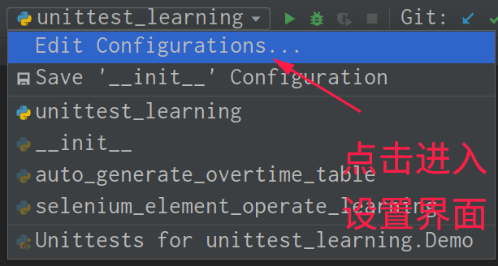

# 一、自动化测试概念

## 1.什么是自动化测试？


## 2.什么项目适合自动化?


## 3.自动化测试的类型划分


## 4.自动化测试用例的设计原则


------

# 二、Web自动化测试的环境设置(Selenium)

## 1. Windows系统

- ### 通过pip install selenium安装最新的selenium包(Python)

- ### 下载对应的chromedriver或geckodriver, 并将driver放到环境变量的路径中

  - chromedriver下载路径:
    - http://npm.taobao.org/mirrors/chromedriver/
    - http://npm.taobao.org/mirrors/geckodriver/

- 在pycharm中导入webdriver即可使用

  ```python
  from selenium import webdriver
  ```


## 2. Linux系统

- ### pip install selenium

- ### 去http://chromedriver.storage.googleapis.com/index.html下载对应版本的Linux chrome驱动

- ### 解压驱动得到chromedriver文件

- ### 打开终端输入以下指令: 

  ```
  sudo chmod 777 chromedirver
  ```

  ```
  sudo cp chromedriver /usr/bin(路径需要填写正确)
  ```

- ### 环境变量配置完成


------

# 三、Webdriver的工作原理


------

# 四、Web自动化测试的LOVE四步法


## 0. Webdriver常用 API-浏览器操作

```python
# 打开url
driver.get(url)

# 关闭
driver.quit()	# 结束进程
driver.close()	# 仅关闭当前窗口

# 设置窗口大小
driver.set_window_size(200, 500)	# 设置窗口大小为宽200,高500

# 最大化窗口
driver.maximize_window()

# 获取网页源码
driver.page_source	# 属性，不用加括号（）

# 获取窗口名称
driver.name		# 属性，不用加括号（）

# 刷新页面
driver.refresh()

# 获取页面标题
driver.title	# 属性，不用加括号（）

# 获取当前页面url地址
driver.current_url		# 属性，不用加括号()

# 获取当前页面截图
driver.get_screenshot_as_file(path)		# 不写path默认保存在当前路径下
```

```python
# 代码举例
from selenium import webdriver		# 导入webdriver模块
import time		# 导入时间库

driver=webdriver.Chrome()		# 新建一个webdriver的实例

driver.set_window_size(200, 500)  # 设置窗口大小为宽200,高500
time.sleep(5)  # 等待5秒
driver.maximize_window()  # 最大化窗口
time.sleep(5)
driver.refresh()  # 刷新窗口

print(driver.page_source)  # 打印源码

# 找到搜索框，输入深空之眼进行搜索
driver.find_element('id', 'kw').click()  # 定位到属性id值为kw的元素并点击它
driver.find_element('id', 'kw').clear()  # 定位到属性id值为kw的元素并清空里面的内容
driver.find_element('id', 'kw').send_keys("深空之眼")  # 定位到id为kw的元素并输入深空之眼

driver.find_element('id', 'su').click()  # 定位到属性id值为su的元素并点击它

print(driver.name)  # 打印窗口名
print(driver.title)  # 打印页面标题
print(driver.current_url)  # 打印当前窗口地址
driver.get_screenshot_as_file('selenium_learning_img.png')	# 截图当前页面

# 等待10秒关闭浏览器
time.sleep(10)
driver.quit()  # 关闭进程
# driver.close()  # 关闭当前窗口(浏览器)
```


## 0.5 元素定位基础知识(HTML前端相关知识)

### a. HTML页面基本结构

```html
<html>
	<head></head>	--> html文档头部区域，在页面中不可见
	<body></body>	--> html文档内容部分，页面中可见
</html>
```


### b. 常见的页面元素

- #### 容器型元素: div(自定义容器), form(表单), table(表格)

- #### 页面元素：link(a 超链接), img(图片), input输入域(button(按钮), text(文本), file(文件)), select(下拉框), checkbox(单选框(yes or no)), radio(复选框), textarea(文本框), submit(提交按钮)


### c. HTML，CSS 和Java Script之间的关系?

- #### HTML组成了页面的基本结构，类似人身体的骨架血肉

- #### CSS是层叠样式表，决定了页面元素显示的外观及位置，相当于美容化妆品

- #### Java Script(简称JS), 主要用于自定义页面元素的行为


### d. 什么是前端？什么是后端？

- #### 前端: 也叫客户端，就是所有与最终用户直接交互的部分

- #### 后端: 也叫服务器端，不直接与最终用户交互，在内部进行调用和数据处理的部分


## 1.(L)元素定位(Locate)----八大元素定位法

- ### 元素定位的方法有很多，总的原则是怎么简单怎么来

- ### 为什么xpath和 css selector是万能的？

  - #### 可以通过位置进行定位

  - #### 可以通过任意属性进行定位

### a. id定位

```python
from selenium import webdriver

driver = webdriver.Chrome()
driver.get("https://www.bilibili.com")  # 打开B站主页

# id定位
print(driver.find_element('id', 'i_cecream'))  # 定位id为i_cecream的元素
```


### b. name定位

```python
# name定位
print(driver.find_element('name', 'keywords'))  # 定位name为keywords的元素
```


### c. class name定位(特指具有class属性的元素)

```python
# class name定位
print(driver.find_element('class name', 'old-browser-tip'))  
# 定位class属性为old-browser-tip的元素

# 对于复合样式(例如:bili-header large-header)不能直接使用class name来进行定位
print(driver.find_element('class name', 'bili-header large-header'))    # 会报错
```


### d. tag name

```python
# tag name定位: 一般用于查找同类元素
print(len(driver.find_elements('tag name', 'input')))  # 定位tag name属性为input的元素
```


### e. link text`<a>`

```python
# link text定位(属性值精准定位):用于定位超链接a标签
driver.find_element('link text', '番剧').click()  # 点击link text属性为番剧的超链接
```


### f. partial link text`<a>`

```python
# partial link text定位(属性值可以为部分)：用于定位超链接a标签
driver.find_element('partial link text', '直').click()   
# 点击link text属性包含直这个字的超链接
```


### g. xpath (万能，可以在chrome中使用$x调试)

- ### xpath语法

  ```python
  # 绝对路径表示法：指从/目录开始的路径表示法(通常是/html),必须根据实际路径逐级表示
  print(driver.find_element('xpath', '/html/body/div'))   
  # 定位绝对路径为/html/body/div的元素
  
  # 相对路径表示法:指从目标对象所在位置根据其父对象进行路径表示的方法
  driver.find_element('xpath', '//body/div[2]//li[2]').click()    # 点击番剧的相对路径
  
  # xpath属性定位法
  driver.find_element('xpath', '//div[@class="header-login-entry"]').click()  
  # 定位div标签class属性为header-login-entry的元素并点击
  time.sleep(2)
  driver.find_element('xpath', '//input[@type="text"][@placeholder="请输入账号"]').click()
  # 定位input标签属性type值为text，placeholder属性值为请输入账号的元素并点击
  driver.find_element('xpath', '//*[@placeholder="请输入账号"]').clear()
  # 定位placeholder属性值为请输入账号的元素并清空
  driver.find_element('xpath', '//*[@placeholder="请输入账号"]').send_keys("12345678900")
  # 定位placeholder属性值为请输入账号的元素并输入12345678900
  
  # # xpath属性模糊定位
  time.sleep(2)
  # 定位属性中的text包含密码的元素并点击
  driver.find_element('xpath', '//*[contains(text(),"密码")]').click()
  # 定位input标签中属性包含placeholder并且值为请输入密码的元素并清空
  driver.find_element('xpath', '//input[contains(@placeholder,"请输入密码")]').clear()
  # 定位input标签中属性包含placeholder并且值为请输入密码的元素并输入123456
  driver.find_element('xpath', '//input[contains(@placeholder,"请输入密码")]').send_keys('123456')
  
  time.sleep(2)
  # 定位属性class值为bili-mini-login-register-wrapper的目录下的第二个子级div标签并点击
  driver.find_element('xpath', '//*[@class="bili-mini-login-register-wrapper"]/div[2]').click()
  
  ```

- #### xpath可以在浏览器中使用Console功能调试($x())

  

### h. css selector (万能，可以在chrome中使用$$调试)

- ### 利用元素的标签、或元素的单一属性定位(id、class等)

  ```python
  # 利用元素标签来定位所有相同元素
  div = driver.find_elements('css selector', 'div')   # 定位标签为div的元素，返回列表
  # print(len(div))
  
  # 利用class属性来进行定位(css样式需要加.作为开头)
  
  # 定位class属性为banner-link的元素并点击
  driver.find_element('css selector', '.banner-link').click() 
  
  # 定位class属性为right-entry__outside go-login-btn的复合css样式并点击
  driver.find_element('css selector', '.right-entry__outside.go-login-btn').click()
  
  # 利用id属性来进行定位(用#号表示id属性后跟id属性值)
  print(driver.find_element('css selector', '#i_cecream'))
  ```

  

- ### 利用多属性定位

  ```python
  # 多属性定位
  # 定位target属性为_blank，class属性为default-entry的第一个元素并点击
  driver.find_elements('css selector', "[target='_blank'][class='default-entry']")[0].click()
  ```

  

- ### 利用标签+属性组合定位

  ```python
  # 组合定位，先用id定位父级，再用class属性定位子级，无法定位的再考虑位置定位
  driver.find_element('css selector',
                      '#i_cecream > div.bili-header.large-header > div.bili-header__bar '
                      '> ul.right-entry > li:nth-child(1) > li > div > div').click()
  ```

  

- ### 利用层级位置(父子\孙子)关系定位

  ```python
  # 利用父子位置关系来定位(父子关系 > 号连接)
  print(driver.find_element('css selector', 'body > iframe').tag_name)
  driver.find_element('css selector',
                      'body > div:nth-child(4) > div:nth-child(1) > div:nth-child(1) '
                      '> ul:nth-child(3) > li:nth-child(1) > li > div > div').click()
  # 注意nth-child()的序号，从1开始，其他的标签也要计数，例如body下第4个标签是要进入的div子级，但是只数div可能是第2个，这里需要填写的序号应该为4
  
  # 利用孙子位置关系来定位(孙子关系 空格连接)
  driver.find_element('css selector', 'ul.right-entry div.header-login-entry').click()
  ```


- ### 模糊匹配定位，相当于xpath中的contains()

  ```python
  # 模糊匹配，相当于xpath中的contains
  driver.find_element('css selector', 'div[class*="header-login-entry"]').click()
  ```

  

- ### css selector也可以在浏览器中使用Console功能调试($$())

  


## 1.5.元素定位总结


## 2.元素操作(Operate)

### a.常见元素操作API

```python
# 清空文本框内的text
clear()

# 点击操作
click()

# 传入指令或发送内容
send_keys()

# 获取节点上的文本信息
text	# 属性，无需括号()

# 获取元素的指定属性的值
get_attribute(属性名)

# 判断元素是否显示出来
is_displayed()
```

- #### 代码举例

  ```python
  driver.get("https://www.baidu.com")
  
  driver.find_element('id', 'kw').click()     # 点击操作
  
  driver.find_element('id', 'kw').clear()     # 清空文本框内容
  
  driver.find_element('id', 'kw').send_keys('Python')     # 输入字符Python
  
  # 定位到属性id值为su的元素并获取此元素的value值
  print(driver.find_element('id', 'su').get_attribute("value"))  
  
  # 定位到超链接text描述为贴吧的元素并打印此元素的text值
  print(driver.find_element('link text', '贴吧').text)  
  
  # 定位到属性id值为form的元素并判断此元素是否为隐藏，返回True or False
  print(driver.find_element('id', 'form').is_displayed())  
  ```


### b.自动化测试三大等待操作

- ### 强制等待/固定等待

  


- ### 隐式等待/全局等待

  


- ### 显示等待

  

  - ### EC常用方法

    ```python
    # 判断当前页面的title是否精确等于预期
    title_is(strtitle)
    
    # 判断当前页面的title是否包含指定字符串
    title_contains(strtitle)
    
    # 判断某个元素是否被加到了dom树里，并不代表该元素一定可见
    presence_of_element_located(locator)
    
    # 判断某个元素是否可见,可见代表元素非隐藏，且元素的宽和高都不等于0
    visibility_of_element_located(locator)
    
    # 判断某个元素是否不可见
    invisibility_of_element_located(locator)
    
    # 判断某个元素中是否可见并且是enable的，这样的话才叫clickable
    element_to_be_clickable(locator)
    
    # 判断某个元素中的text是否包含了预期的字符串
    text_to_be_present_in_element(locator)
    ```


  - ### 代码举例

  ```python
  # 显示等待
  def func1():
      driver.get("https://www.baidu.com")
      WebDriverWait(driver, 10).until(ec.title_is("百度一下，你就知道"))  # 判断当前页面的title是否精确等于预期
      driver.find_element('id', 'kw').send_keys("正确")
  
  
  # 显示等待
  def func2():
      driver.get("https://www.baidu.com")
      WebDriverWait(driver, 5).until(ec.title_contains("百度一下"))  # 判断当前页面的title是否包含指定字符串
      driver.find_element('id', 'kw').send_keys("正确")
  
  
  # 显示等待
  def func3():
      driver.get("https://www.bilibili.com")
      WebDriverWait(driver, 5).until(ec.title_contains("哔哩哔哩"))  # 等待标题哔哩哔哩出现
      driver.execute_script("window.scrollTo(0,300);")  # 滑动页面滚轮从坐标0到300
      # 判断某个元素是否被加到了dom树里，并不代表该元素一定可见
      WebDriverWait(driver, 10).until(ec.presence_of_element_located(('class name', 'login-tip')))  # 判断悬浮登陆框是否出现
      driver.find_element('class name', 'login-tip').click()
  
      
  # 显示等待
  def func4():
      driver.get("http://www.baidu.com")
      # 判断某个元素是否可见,可见代表元素非隐藏，且元素的宽和高都不等于0，时间到了仍不可见报错
      WebDriverWait(driver, 5).until(ec.visibility_of_element_located(('link text', '高级搜索')))  # 需要以元组形式传入参数
      driver.find_element('link text', '高级搜索').click()
  
  
  # 显示等待
  def func5():
      driver.get("https://www.baidu.com")
      # 判断某个元素是否不可见,在等待时间内可见则报错
      WebDriverWait(driver, 10).until(ec.invisibility_of_element_located(('link text', '高级搜索')))  # 需要以元组形式传入参数
  
  
  # 显示等待
  def func6():
      driver.get("https://www.baidu.com")
      # 判断某个元素中是否可见并且是enable的，这样的话才叫clickable
      WebDriverWait(driver, 5).until(ec.element_to_be_clickable(('link text', '高级搜索')))
      driver.find_element('link text', '高级搜索').click()
  
  
  # 显示等待
  def func7():
      driver.get("https://www.baidu.com")
      driver.find_element('id', 'kw').send_keys("Python")
      # 判断某个元素中的text是否包含了预期的字符串
      WebDriverWait(driver, 5).until(
          ec.text_to_be_present_in_element(('xpath', '//form[@id="form"]/div/ul/li[1]'), "是什么意思"))
      driver.find_element('xpath', '//form[@id="form"]/div/ul/li[1]').click()
  ```


### c.元素操作进阶

- ### 复选框常见操作

  ```python
  is_displayed()	# 判断元素是否被隐藏
  
  is_enabled()	# 判断元素是否被使用
  
  is_selected()	# 判断元素是否被选中
  
  ```

  ```python
  # 代码举例
  def func8():
      driver.get("https://flight.qunar.com/")
      
      # 判断元素是否被选中
      print(driver.find_element('id', 'searchTypeRnd').is_selected())  
       # 判断元素是否被使用
      print(driver.find_element('id', 'searchTypeRnd').is_enabled()) 
      # 判断元素是否被隐藏
      print(driver.find_element('id', 'searchTypeSng').is_displayed())  
  
  ```


- ### 发送组合按键

  ```python
  from selenium.webdriver.common.keys import Keys		# 导入 Keys包
  
  def func9():
      driver.get("https://www.baidu.com")
      # 按住SHIFT键输入python
      driver.find_element("id", "kw").send_keys(Keys.SHIFT, "python")
      time.sleep(1)
      # 输入python 50次
      driver.find_element("id", "kw").send_keys("python" * 50)
      time.sleep(1)
      # 按住control键点击a键
      driver.find_element("id", "kw").send_keys(Keys.CONTROL, "a")
      time.sleep(1)
      # 点击delete键
      driver.find_element("id", "kw").send_keys(Keys.DELETE)
  
  ```


- ### 下拉列表常见操作

  ```python
  from selenium.webdriver.support.ui import Select
  
  driver.get("http://www.fanyunedu.com:5000/general/web")
  
  # 通过序号选择下拉框的值
  Select(driver.find_element('tag name', 'select')).select_by_index(1)
  time.sleep(1)
  
  # 通过value属性选择下拉框的值
  Select(driver.find_element('tag name', 'select')).select_by_value("sh")
  time.sleep(1)
  
  # 通过下拉框的text文字选择
  Select(driver.find_element('tag name', 'select')).select_by_visible_text("北京")
  ```


### d. Frame嵌套应用操作


```python
from selenium import webdriver

# 切换frame
# 使用 switch_to.frame()方法，把当前定位的主体切换到B frame里
switch_to.frame(driver.find_element('xpath','/html/body/div[4]/iframe'))

# 使用 switch_to.default_content()方法，从B frame切换回A frame
switch_to.default_content()
```

```python
# 代码举例
def func11():
    driver.get("https://mail.qq.com")
    time.sleep(2)

    # 切换到iframe
    driver.switch_to.frame(driver.find_element('name', 'login_frame'))

    driver.find_element('id', 'u').clear()
    driver.find_element('id', 'u').send_keys('888888')

    # 切换回原本的frame
    driver.switch_to.default_content()
    driver.find_element('link text', '关于腾讯').click()
```


### e.文件上传操作(直接使用send_keys)

```python
def func12():
    driver.get("http://www.fanyunedu.com:5000/general/web")
    
    # 利用input标签的type属性为file，直接用send_keys()方法上传文件，但注意文件必须是使用绝对路径
    driver.find_element('xpath', '//input[@type="file"]').send_keys(
        r"/home/kirk/Desktop/learn-code/level_13/selenium_learning_img.png")
```


### f.多窗口来回切换操作(使用switch_to().window(handle)来切换窗口)

```python
from selenium import webdriver

curhandle = driver.current_window_handle	# 获取并记录当前窗口
allhandles = driver.window_handles	#获取所有窗口
for handle in allhandles:
    if handle != curhandle:	# 不是当前窗口就进行切换，并继续后续操作
        driver.switch_to().window(handle)
        driver.find_element('id', 'xxx').click()
        driver.close()
driver.switch_to.window(curhandle)	# 切换回原来的窗口，继续进行其他操作
...
```

```python
# 代码举例
def func13():
    driver.get("http://www.fanyunedu.com:5000/general/web")

    # 记录当前窗口
    old_window = driver.current_window_handle  # 保留当前窗口句柄
    driver.find_element('link text', '打开百度').click()
    time.sleep(1)

    # 切换到百度的窗口上
    driver.switch_to.window(driver.window_handles[2])  # 之前的窗口就是0,下一个窗口就是1依次计数
    driver.find_element('id', 'kw').send_keys('python')
    time.sleep(2)

    # 切换回原来的窗口
    driver.switch_to.window(old_window)
    driver.find_element('name', 'alert1').click()
```


### g. 悬浮框操作

```python
from selenium.webserver import ActionChains

# 通过ActionChains的move_to_element().perform()方法控制鼠标移动
ActionChains(driver).move_to_element(element).perform()
```


```python
# 代码举例
def func14():
    driver.get("https://www.baidu.com")
    item = driver.find_element('id', "s-usersetting-top")
    ActionChains(driver).move_to_element(item).perform()  # 模拟鼠标移动操作
    driver.find_element('link text', '高级搜索').click()

def func15():
    driver.get("https://www.baidu.com")
    driver.find_element('id', 'kw').send_keys('python')	# 搜索栏的悬浮框
    
    # 把悬浮框中的内容通过想同的class属性值筛选出来
    menus = driver.find_elements('class name', 'bdsug-overflow')    
    for menu in menus:
        print(menu.text)    # 遍历打印悬浮框中内容的text文本

    menus[5].click()    # 通过序号直接点击对应元素


def func16():
    driver.get("https://www.qq.com")
    # 模拟鼠标移动操作
    ActionChains(driver).move_to_element(driver.find_element('class name', 'more-txt')).perform()
    
    driver.find_element('link text', '车型').click()
```


### h. 验证码处理操作


------

# 五.结果断言(Verificate)----Unittest框架

## 1.  Unittest 框架是什么？为什么要使用unittest框架？

- ## 是一个通用的测试框架，用于管理测试脚本项目和执行。


## 2.通过unittest框架创建测试

### 	(1). 必须继承于unittest.TestCase类

```python
import unittest

class Demo(unittest.TestCase):  # 必须继承于unittest.TestCase类
```


### 	(2). 可以定义setUp()和tearDown()方法进行初始化, 也可以使用setUpClass()和tearDownClass()来进行初始化

```python
    def setUp(self) -> None:	# 每个测试方法执行前执行一次
        print("这是每一个test case开始的初始化方法")

    def tearDown(self) -> None:		# 每个测试方法执行结束后执行一次
        print("这是每一个test case结束的初始化方法\n")
    
    @classmethod
    def setUpClass(cls):	# 整个测试执行前执行一次
        print("这是setUpClass方法，优先级在setUp方法之前")

    @classmethod
    def tearDownClass(cls) -> None:		# 整个测试执行结束后执行一次
        print("这是tearDownClass方法，优先级在最后的最后，所有测试结束以后执行")
   
```


### 	(3). 所有测试方法必须以test开头(例如testFunc1或者test_Func1等), 测试方法会在运行时自动被调用

```python
	@staticmethod
    def test_case2():
        print("这是test_case2方法")

    @staticmethod
    def testLogin():
        print("这是testLogin方法")

    @staticmethod
    def testBogin():
        print("这是test Bogin方法")

    @staticmethod
    def test_case1():
        print("这是test_case1方法")
```


### (4). 可以pycharm自带的unittest框架运行，也可以以普通的py文件方式运行

- ### 以python自带的unittest框架来运行测试类，显示Run 'Unittest for unit....'

  

  - ### 设置为以python自带的unittest框架来运行测试类

    

  

  - ### 以python自带的unittest框架来运行时，只会执行当前py文件中继承了unittest.TestCase类的测试类，并不会执行其他的代码语句

    


- ### 以普通py文件方式运行需要在Run/Debug Configurations中设置正确的Script path

  

  

  - ### 以py文件来运行时，会执行当前py文件中if __name__ == "__main__":语句下的所有代码

    


## 3.通过unittest框架添加断言(<u>断言结果为PASS则输出符号'.'/Fail则输出符号'F'/有语法错误输出‘E’</u>)

- ### 常见断言语句

  ```python
  assertIn('d', 'abc')  # 判断d是否在abc中，不在就会报错
  
  assertNotIn('d', 'abc')  # 判断d是否不在abc中，在就会报错
  
  assertEqual(1, 1)  # 判断两个元素是否相等,不相等会报错
  
  assertNotEqual(1, 2)  # 判断两个元素是否不相等,相等会报错
  
  assertTrue(1)  # 判断传入的元素是否为True,不为True则报错
  
  assertFalse([])  # 判断传入的元素是否为False，不为False报错
  ```

  ```python
  # 代码举例
  import unittest
  
  
  class TestAssert(unittest.TestCase):
  
          def testFunc2(self):
          self.func1()    # 在测试方法中调用一个普通方法
          print("这是一个测试assertIn的方法")
          self.assertIn('d', 'abc')  # 判断d是否在abc中，不在就会报错
          print("这句话不会被执行")   # 断言测试结果为Fail，则后续语句不会被执行
  
      def testFunc1(self):
          print("这是一个测试assertNotIn的方法")
          self.assertNotIn('d', 'abc')  # 判断d是否不在abc中，在就会报错
          print("这句话可以执行")    # 断言测试结果为Pass，则后续语句会被执行
  
      def testFunc3(self):
          print("这是一个测试assertEqual的方法")
          self.assertEqual(1, 1)  # 判断两个元素是否相等,不相等会报错
  
      def testFunc4(self):
          print("这是一个测试assertNotEqual的方法")
          self.assertNotEqual(1, 2)  # 判断两个元素是否不相等,相等会报错
  
      def testFunc5(self):
          print("这是一个测试assertTrue的方法")
          self.assertTrue(1)  # 判断传入的元素是否为True,不为True则报错
  
      def testFunc6(self):
          print("这是一个测试assertFalse的方法")
          self.assertFalse([])  # 判断传入的元素是否为False，不为False报错
  
      @staticmethod
      def func1():
          print("这是一个普通方法，不是测试方法,通过测试方法内部调用执行")
  ```

  


## 4. 通过unittest.TestLoader类方法对脚本进行管理


- ### unittest.TestLoader类常见方法

  - #### 通过loadTestsFromTestCase()方法管理test case

    ```python
    from level_13.unittest_learn.reg.stringtests import StringTests
    from level_13.unittest_learn.reg.numbertests import NumberTests
    import unittest
    
    if __name__ == '__main__':
        # 通过unittest.defaultTestLoader.loadTestsFromTestCase()管理test case
        st = unittest.defaultTestLoader.loadTestsFromTestCase(StringTests)
        nt = unittest.defaultTestLoader.loadTestsFromTestCase(NumberTests)
        # 将test case的实例通过unittest.TestSuite实例化为一个 test suite
        suite = unittest.TestSuite([st, nt])
    
        # 通过unittest.TextTestRunner().run()方法运行suite
        unittest.TextTestRunner().run(suite)
    ```

  

  - #### 通过loadTestsFromModule()方法管理test case

    ```python
    from level_13.unittest_learn.reg import stringtests as st, numbertests as nu
    import unittest
    
    if __name__ == '__main__':
        names = [st, nu]
        modules = []
    
        for item in names:
            # 通过unittest.defaultTestLoader.loadTestsFromModule()方法管理test case
            module = unittest.defaultTestLoader.loadTestsFromModule(st)
            modules.append(module)
        
        suite = unittest.TestSuite(modules)
        unittest.TextTestRunner().run(suite)
    ```

  

  - #### 通过loadTestsFromNames()方法管理test case

    - #### 方法一

      ```python
      import unittest
      
      if __name__ == '__main__':
          # 方法一
          # 方法名最好写绝对路径或者不会变动的相对路径
          # names = ['level_13.unittest_learn.reg.numbertests.NumberTests.testSub',
          #          'level_13.unittest_learn.reg.stringtests.StringTests.testStr1']
          names = ['reg.numbertests.NumberTests.testSub',
                   'reg.stringtests.StringTests.testStr1']
          # 通过unittest.defaultTestLoader.loadTestsFromNames()方法管理test case
          name_test = unittest.defaultTestLoader.loadTestsFromNames(names)
          suite = unittest.TestSuite([name_test])
          unittest.TextTestRunner().run(suite)
      ```

    - #### 方法二

      ```python
      import unittest
      
      def getFullTestCaseName(names):
          """
          获取符合条件的test case的名称，通常用于过滤smoke/sys/reg等测试
          :param names: 接收通过unittest.defaultTestLoader.getTestCaseNames()方法获取测试类中的test case名称列表
          :return: 符合条件的test case名称列表 --> return List
          """
          full_names = []
          for item in names:
              # 过滤条件，test case的名称中是否包含某些字符
              if 'Sub' in item:   
                  # 添加前缀路径
                  full_names.append('reg.numbertests.NumberTests.' + item)   
      
          return full_names
      
      
      if __name__ == '__main__':
          # 方法二
          from level_13.unittest_learn.reg.numbertests import NumberTests
      
          # 通过unittest.defaultTestLoader.getTestCaseNames()方法获取测试类中的test case名称列表
          names_ = unittest.defaultTestLoader.getTestCaseNames(NumberTests)
          # 定义并传入getFullTestCaseName方法，返回符合条件的test case 名称列表
          name_test = unittest.defaultTestLoader.loadTestsFromNames(getFullTestCaseName(names_))
          
          suite = unittest.TestSuite([name_test])
          
          unittest.TextTestRunner().run(suite)
      ```
  
      
    
  - #### 通过discover()方法管理test case
  
    - #### 需要先将所有的脚本文件分类存放
  
      
  
    ```python
    import unittest
    
    if __name__ == '__main__':
        # 通过discover()方法运行reg回归测试脚本
        dis = unittest.defaultTestLoader.discover(r'./reg', pattern='*.py')
        suite = unittest.TestSuite(dis)
        unittest.TextTestRunner().run(suite)
    ```
  
    ```python
    # 通过discover()方法运行所有路径下的test case
    
    import unittest
    
    
    # 获取所有的test case
    def get_all_cases():
        for case_dir in ['reg', 'smoke', 'sys']:
            dis_ = unittest.defaultTestLoader.discover(r'../unittest_learn/' + case_dir, pattern='*.py')
            suite_ = unittest.TestSuite(dis_)
        return suite_
    
    if __name__ == '__main__':
        # 执行所有的test case(reg/smoke/sys)
        unittest.TextTestRunner().run(get_all_cases())
    ```


## 5. unittest自定义生成测试报告


```python
# 代码举例
from level_13.unittest_learn.smoke.smoke_test_baidu_login import BaiduLoginTest
from HTMLTestRunnerCN import HTMLTestReportCN
import unittest

if __name__ == '__main__':
    test1 = unittest.defaultTestLoader.loadTestsFromTestCase(BaiduLoginTest)
    suite = unittest.TestSuite(test1)

    runner = HTMLTestReportCN(
        title='带截图的百度登陆测试报告',	# 标题
        description='xxx软件测试报告v0.1',	# 描述
        stream=open('sample_test_report.html', 'wb'),
        verbosity=2,
        tester='Kirk'	# 测试人员
    )
    runner.run(suite)
```


## 6. unittest框架中使用参数化(数据驱动)

```python
# 先安装ddt包(重要)
pip install -i https://pypi.douban.com/simple ddt
```


### 1.什么是参数化(数据驱动)

- #### 指利用不同测试数据来测试相同场景，为了提高代码重用性，增加代码效率而采用的一种代码编写方法，叫做参数化，也就是数据驱动。

- #### 测试数据与测试业务分离


### 2.从函数中返回参数值

```python
# Util文件用于存放工具类函数

import json
import os
import sys

if getattr(sys, 'frozen', False):
    current_path = os.path.dirname(sys.executable)
else:
    current_path = os.path.dirname(os.path.realpath(__file__))

config_json_file_path = os.path.join(current_path, 'smoke_test_baidu_login.json')

if os.path.isfile(config_json_file_path):
    with open(config_json_file_path, 'r',
              encoding='utf-8') as data:
        conf = json.load(data)


class Util:
    username = conf.get("username")
    password = conf.get("password")

    @classmethod
    def get_data(cls):
        """
        通过此函数返回数据
        :return: 
        """
        testdata = [
            ("", cls.password, '请您输入手机号/用户名/邮箱'),
            (cls.username, "", "请您输入密码"),
            (cls.username + 'x', cls.password, '用户名或密码有误，请重新输入或找回密码'),
            (cls.username, cls.password + 'x', '用户名或密码有误，请重新输入或找回密码')
        ]
        return testdata
	
    # 
    @classmethod
    def get_data_from_file(cls, path):
        """
        通过文件获取数据
        :param path: 文件路径
        :return:
        """
        rows = []
        with open(path, 'r', encoding='utf-8') as f:
            for line in f:
                user_data = line.strip().split(',')
                rows.append(user_data)
        return rows
```


```python
# 代码范例
import time

from selenium import webdriver
from selenium.common.exceptions import NoSuchElementException
from selenium.webdriver.support.wait import WebDriverWait
from selenium.webdriver.support import expected_conditions as ec
from ddt import ddt, data, unpack
from level_13.unittest_learn.smoke.util import Util
import unittest

@ddt	# 一定要加ddt装饰器
class BaiduLoginTest(unittest.TestCase):

    def setUp(self) -> None:

        self.driver = webdriver.Chrome()
        self.url = 'https://www.baidu.com'
        self.driver.implicitly_wait(20)
        self.imgs = []  # 用于保存截图

    def tearDown(self) -> None:
        self.driver.quit()

    def find_element(self, locator: tuple):
        try:
            element = WebDriverWait(self.driver, 30).until(lambda x: x.find_element(*locator))
            return element
        except NoSuchElementException as e:
            print('Error details: {}'.format(e.args[0]))
            raise e

    def test_login_success(self):
        """
        测试当用户名和密码正确时，用户能够成功登陆到系统中
        :return:
        """
        self.driver.get(self.url)
        self.find_element(('id', 's-top-loginbtn')).click()
        WebDriverWait(self.driver, 10).until(ec.element_to_be_clickable(('id', 'TANGRAM__PSP_11__userName')))
        self.find_element(('id', 'TANGRAM__PSP_11__userName')).clear()
        self.find_element(('id', 'TANGRAM__PSP_11__userName')).send_keys(Util.username)
        time.sleep(1)
        self.find_element(('id', 'TANGRAM__PSP_11__password')).clear()
        self.find_element(('id', 'TANGRAM__PSP_11__password')).send_keys(Util.password)
        time.sleep(1)
        self.find_element(('id', 'TANGRAM__PSP_11__submit')).click()
        WebDriverWait(self.driver, 30).until(
            ec.text_to_be_present_in_element(('css selector', '.user-name.c-font-normal.c-color-t'), Util.username))
        login_name = self.find_element(('css selector', '.user-name.c-font-normal.c-color-t')).text
        self.imgs.append(self.driver.get_screenshot_as_base64())  # 执行截图操作，将当前截图加入到测试报告中
        self.assertEqual(login_name, Util.username)

    @data(
         *Util.get_data()	# 通过函数调用获取数据，数据需要解包传入
     )
    @unpack	# 再次解包依次传给对应参数
    def test_dataTest_login_failed(self, username, password, err):
        """
        通过数据驱动测试所有登陆失败的测试用例
        :return:
        """
        self.driver.get(self.url)
        time.sleep(1)
        self.find_element(('id', 's-top-loginbtn')).click()
        WebDriverWait(self.driver, 10).until(ec.element_to_be_clickable(('id', 'TANGRAM__PSP_11__userName')))
        self.find_element(('id', 'TANGRAM__PSP_11__userName')).clear()
        self.find_element(('id', 'TANGRAM__PSP_11__userName')).send_keys(username)
        time.sleep(1)
        self.find_element(('id', 'TANGRAM__PSP_11__password')).clear()
        self.find_element(('id', 'TANGRAM__PSP_11__password')).send_keys(password)
        time.sleep(1)
        self.find_element(('id', 'TANGRAM__PSP_11__submit')).click()
        login_msg = self.find_element(('id', 'TANGRAM__PSP_11__error')).text
        if login_msg == '':
            login_msg = self.find_element(('xpath', "//*[contains(text(),'，请重新输入或')]")).text
        self.imgs.append(self.driver.get_screenshot_as_base64())  # 执行截图操作，将当前截图加入到测试报告中
        self.assertEqual(login_msg, err)
        time.sleep(1)


if __name__ == '__main__':
    unittest.main()
```


### 3.从文件中返回参数值

```python
# 代码范例
import time

from selenium import webdriver
from selenium.common.exceptions import NoSuchElementException
from selenium.webdriver.support.wait import WebDriverWait
from selenium.webdriver.support import expected_conditions as ec
from ddt import ddt, data, unpack
from level_13.unittest_learn.smoke.util import Util
import unittest

@ddt	# 一定要加ddt装饰器
class BaiduLoginTest(unittest.TestCase):

    def setUp(self) -> None:

        self.driver = webdriver.Chrome()
        self.url = 'https://www.baidu.com'
        self.driver.implicitly_wait(20)
        self.imgs = []  # 用于保存截图

    def tearDown(self) -> None:
        self.driver.quit()

    def find_element(self, locator: tuple):
        try:
            element = WebDriverWait(self.driver, 30).until(lambda x: x.find_element(*locator))
            return element
        except NoSuchElementException as e:
            print('Error details: {}'.format(e.args[0]))
            raise e

    def test_login_success(self):
        """
        测试当用户名和密码正确时，用户能够成功登陆到系统中
        :return:
        """
        self.driver.get(self.url)
        self.find_element(('id', 's-top-loginbtn')).click()
        WebDriverWait(self.driver, 10).until(ec.element_to_be_clickable(('id', 'TANGRAM__PSP_11__userName')))
        self.find_element(('id', 'TANGRAM__PSP_11__userName')).clear()
        self.find_element(('id', 'TANGRAM__PSP_11__userName')).send_keys(Util.username)
        time.sleep(1)
        self.find_element(('id', 'TANGRAM__PSP_11__password')).clear()
        self.find_element(('id', 'TANGRAM__PSP_11__password')).send_keys(Util.password)
        time.sleep(1)
        self.find_element(('id', 'TANGRAM__PSP_11__submit')).click()
        WebDriverWait(self.driver, 30).until(
            ec.text_to_be_present_in_element(('css selector', '.user-name.c-font-normal.c-color-t'), Util.username))
        login_name = self.find_element(('css selector', '.user-name.c-font-normal.c-color-t')).text
        self.imgs.append(self.driver.get_screenshot_as_base64())  # 执行截图操作，将当前截图加入到测试报告中
        self.assertEqual(login_name, Util.username)
	
    # # 通过读取文件获取数据，数据需要解包传入
    @data(
         *Util.get_data_from_file('/home/kirk/Desktop/learn-code/level_13/unittest_learn/smoke/data.txt')	
     )
    @unpack	# 再次解包依次传给对应参数
    def test_dataTest_login_failed(self, username, password, err):
        """
        通过数据驱动测试所有登陆失败的测试用例
        :return:
        """
        self.driver.get(self.url)
        time.sleep(1)
        self.find_element(('id', 's-top-loginbtn')).click()
        WebDriverWait(self.driver, 10).until(ec.element_to_be_clickable(('id', 'TANGRAM__PSP_11__userName')))
        self.find_element(('id', 'TANGRAM__PSP_11__userName')).clear()
        self.find_element(('id', 'TANGRAM__PSP_11__userName')).send_keys(username)
        time.sleep(1)
        self.find_element(('id', 'TANGRAM__PSP_11__password')).clear()
        self.find_element(('id', 'TANGRAM__PSP_11__password')).send_keys(password)
        time.sleep(1)
        self.find_element(('id', 'TANGRAM__PSP_11__submit')).click()
        login_msg = self.find_element(('id', 'TANGRAM__PSP_11__error')).text
        if login_msg == '':
            login_msg = self.find_element(('xpath', "//*[contains(text(),'，请重新输入或')]")).text
        self.imgs.append(self.driver.get_screenshot_as_base64())  # 执行截图操作，将当前截图加入到测试报告中
        self.assertEqual(login_msg, err)
        time.sleep(1)


if __name__ == '__main__':
    unittest.main()
```


------

# 六. 异常处理(Except)

## 1.  Selenium自动化测试智能等待封装方法实例

```python
from selenium.common.exceptions import NoSuchElementException

def find_element(self, locator: tuple):
    try:
        # 匿名函数的作用为接收元组型参数，并作为函数执行，返回定位到的元素
        element = WebDriverWait(self.driver, 30).until(lambda x: x.find_element(*locator))
        return element
    except NoSuchElementException as e:
        print('Error details: {}'.format(e.args[0]))
        raise e
```


## 2. unittest框架中断言失败后截图(使用自定义断言装饰器)

- ### 单例

```python
# 代码举例
from selenium import webdriver
import unittest


class AssertTest(unittest.TestCase):

    def setUp(self) -> None:
        self.driver = webdriver.Chrome()
        self.url = "https://www.baidu.com"

    def tearDown(self) -> None:
        self.driver.quit()

    def test_demo1(self):
        try:
            self.driver.get(self.url)
            self.assertEqual(1, 2)
        except AssertionError as e:
            import os, time
            day = time.strftime('%Y%m%d', time.localtime(time.time()))  # 捕捉年月日
            # 截图存放路径
            screenshot_path = os.getcwd() + r'\reports\screenchot_%s' % day  # 通过os.getcwd()获取当前绝对路径
            if not os.path.exists(screenshot_path):
                os.makedirs(screenshot_path)

            tm = time.strftime('%H%M%S', time.localtime(time.time()))  # 捕捉时分秒
            self.driver.get_screenshot_as_file(screenshot_path + r'/{}_{}.png'.format('screen_shot', tm))
            raise e  # 继续抛出异常给unittest，必须写


if __name__ == '__main__':
    unittest.main()
```


- ### 集成(定义装饰器)

```python
# 代码举例
import os
import time
from selenium import webdriver
import unittest


# 定义截图装饰器
def add_pic(func):
    def wrapper(*args, **kwargs):
        try:
            func(*args, **kwargs)
        except AssertionError as e:
            day = time.strftime('%Y%m%d', time.localtime(time.time()))
            screenshot_path = os.getcwd() + r'\reports\screenshot_%s' % day
            if not os.path.exists(screenshot_path):
                os.makedirs(screenshot_path)

            tm = time.strftime('%H%M%S', time.localtime(time.time()))
            y = lambda x: x.get_screenshot_as_file(screenshot_path + '/{}_{}.png'.format('screen_shot', tm))
            print(y)
            raise e

    return wrapper


class AssertTest(unittest.TestCase):

    def setUp(self) -> None:
        self.driver = webdriver.Chrome()
        self.url = "https://www.baidu.com"

    def tearDown(self) -> None:
        self.driver.quit()
        
    @add_pic	# 引用装饰器，通过装饰器进行截图
    def testFunc(self):
        self.driver.get(self.url)
        self.assertEqual(1, 2)
```


------

# 七. selenium 自动化测试unittest 项目实战----百度的登陆测试

```python
# 代码范例
import json
import os
import sys
import time

from selenium import webdriver
from selenium.webdriver.support.wait import WebDriverWait
from selenium.webdriver.support import expected_conditions as ec
import unittest

if getattr(sys, 'frozen', False):
    current_path = os.path.dirname(sys.executable)
else:
    current_path = os.path.dirname(os.path.realpath(__file__))

config_json_file_path = os.path.join(current_path, 'smoke_test_baidu_login.json')


class BaiduLoginTest(unittest.TestCase):

    def setUp(self) -> None:
        if os.path.isfile(config_json_file_path):
            with open(config_json_file_path, 'r',
                      encoding='utf-8') as data:
                conf = json.load(data)
        self.username = conf.get("username")
        self.password = conf.get("password")
        self.driver = webdriver.Chrome()
        self.url = 'https://www.baidu.com'
        self.driver.implicitly_wait(20)

    def tearDown(self) -> None:
        self.driver.quit()

    def test_login_success(self):
        """
        测试当用户名和密码正确时，用户能够成功登陆到系统中
        :return:
        """
        self.driver.get(self.url)
        self.driver.find_element('id', 's-top-loginbtn').click()
        WebDriverWait(self.driver, 10).until(ec.element_to_be_clickable(('id', 'TANGRAM__PSP_11__userName')))
        self.driver.find_element('id', 'TANGRAM__PSP_11__userName').clear()
        self.driver.find_element('id', 'TANGRAM__PSP_11__userName').send_keys(self.username)
        time.sleep(1)
        self.driver.find_element('id', 'TANGRAM__PSP_11__password').clear()
        self.driver.find_element('id', 'TANGRAM__PSP_11__password').send_keys(self.password)
        time.sleep(1)
        self.driver.find_element('id', 'TANGRAM__PSP_11__submit').click()
        WebDriverWait(self.driver, 30).until(
            ec.text_to_be_present_in_element(('css selector', '.user-name.c-font-normal.c-color-t'), self.username))
        login_name = self.driver.find_element('css selector', '.user-name.c-font-normal.c-color-t').text
        self.assertEqual(login_name, self.username)

    def test_login_failed_without_username(self):
        """
        测试没有输入用户名时，登陆失败的情况
        :return:
        """
        self.driver.get(self.url)
        self.driver.find_element('id', 's-top-loginbtn').click()
        WebDriverWait(self.driver, 10).until(ec.element_to_be_clickable(('id', 'TANGRAM__PSP_11__userName')))
        self.driver.find_element('id', 'TANGRAM__PSP_11__userName').clear()
        self.driver.find_element('id', 'TANGRAM__PSP_11__userName').send_keys('')
        time.sleep(1)
        self.driver.find_element('id', 'TANGRAM__PSP_11__password').clear()
        self.driver.find_element('id', 'TANGRAM__PSP_11__password').send_keys(self.password)
        time.sleep(1)
        self.driver.find_element('id', 'TANGRAM__PSP_11__submit').click()
        login_msg = self.driver.find_element('id', 'TANGRAM__PSP_11__error').text
        self.assertEqual(login_msg, '请您输入手机号/用户名/邮箱')
        time.sleep(1)

    def test_login_failed_without_password(self):
        """
        测试没有输入密码时，登陆失败的情况
        :return:
        """
        self.driver.get(self.url)
        self.driver.find_element('id', 's-top-loginbtn').click()
        WebDriverWait(self.driver, 10).until(ec.element_to_be_clickable(('id', 'TANGRAM__PSP_11__userName')))
        self.driver.find_element('id', 'TANGRAM__PSP_11__userName').clear()
        self.driver.find_element('id', 'TANGRAM__PSP_11__userName').send_keys(self.username)
        time.sleep(1)
        self.driver.find_element('id', 'TANGRAM__PSP_11__password').clear()
        self.driver.find_element('id', 'TANGRAM__PSP_11__password').send_keys('')
        time.sleep(1)
        self.driver.find_element('id', 'TANGRAM__PSP_11__submit').click()
        login_msg = self.driver.find_element('id', 'TANGRAM__PSP_11__error').text
        self.assertEqual(login_msg, '请您输入密码')
        time.sleep(1)

    def test_login_failed_with_error_username(self):
        """
        测试输入错误用户名时，登陆失败的情况
        :return:
        """
        self.driver.get(self.url)
        self.driver.find_element('id', 's-top-loginbtn').click()
        WebDriverWait(self.driver, 10).until(ec.element_to_be_clickable(('id', 'TANGRAM__PSP_11__userName')))
        self.driver.find_element('id', 'TANGRAM__PSP_11__userName').clear()
        self.driver.find_element('id', 'TANGRAM__PSP_11__userName').send_keys(self.username + 'x')
        time.sleep(1)
        self.driver.find_element('id', 'TANGRAM__PSP_11__password').clear()
        self.driver.find_element('id', 'TANGRAM__PSP_11__password').send_keys(self.password)
        time.sleep(1)
        self.driver.find_element('id', 'TANGRAM__PSP_11__submit').click()
        login_msg = self.driver.find_element('xpath', '//*[contains(text(),"用户名或密码有误，请重新输入或")]').text
        self.assertEqual(login_msg, '用户名或密码有误，请重新输入或找回密码')
        time.sleep(1)

    def test_login_failed_with_error_password(self):
        """
        测试输入错误密码时，登陆失败的情况
        :return:
        """
        self.driver.get(self.url)
        self.driver.find_element('id', 's-top-loginbtn').click()
        WebDriverWait(self.driver, 10).until(ec.element_to_be_clickable(('id', 'TANGRAM__PSP_11__userName')))
        self.driver.find_element('id', 'TANGRAM__PSP_11__userName').clear()
        self.driver.find_element('id', 'TANGRAM__PSP_11__userName').send_keys(self.username)
        time.sleep(1)
        self.driver.find_element('id', 'TANGRAM__PSP_11__password').clear()
        self.driver.find_element('id', 'TANGRAM__PSP_11__password').send_keys(self.password + 'x')
        time.sleep(1)
        self.driver.find_element('id', 'TANGRAM__PSP_11__submit').click()
        login_msg = self.driver.find_element('xpath', '//*[contains(text(),"用户名或密码有误，请重新输入或")]').text
        self.assertEqual(login_msg, '用户名或密码有误，请重新输入或找回密码')
        time.sleep(1)


if __name__ == '__main__':
    unittest.main()
```


