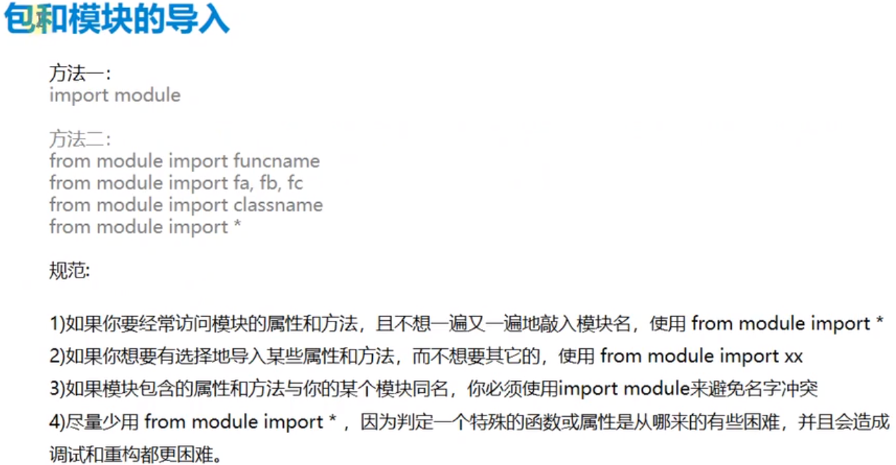

# Python基础

## 一、程序的基本概念和开发环境搭建


#### 1、如何从一堆数字中找到最大的那个数？ [1, 3, 17, 4, 34, 56]

```python
"""
如何从一堆数字中找到最大的那个数？ [1, 3, 17, 4, 34, 56]
"""
# 1
a = [1, 3, 17, 4, 34, 56]
max_ = a[0]
for _ in a:
	if _ > max_:
		max_ = _
print(max_)

# 2
a = [1, 3, 17, 4, 34, 56]
a = max(a)
print(a)
```

#### 2、占位符 ， 输入/输出

```python
"""
占位符 ， 输入/输出
"""
a = 100 / 3
b = 'xxxx'
print(f'学生评分：{a:.2f}', end='  ')
print(f'学生姓名：{b}')
```


## 二、数据类型

### 1、数据类型定义


#### a.不可变数据类型(Number/String/Tuple)

```python
"""
不可变数据类型
Number string tuple
"""
a = 1
print(id(a))  # 每个变量Id值一定是唯一的，如果两个变量ID是不同的，则一定是两个不同的变量
print(a)

a += 1
print(id(a))
print(a)

b = 2
print(id(b))  # a的值改变以后和b的值相同，则指向同一个内存地址(ID)
print(b)
```

#### b.可变数据类型(List/Set/Dictionary)

```python
"""
可变数据类型
list set dictionary 
"""
a = [1, 2, 3]
print(id(a))  # 列表a的值有变化后，依然指向同一个内存地址(id)
print(a)

a.append(4)
print(id(a))
print(a)
```

### 2、数值类型(Number)


#### a.数值类型常用方法及常用模块

- ```python
  import math		# 调用数学模块
  math.ceil(x)		# 取大于等于x的最小整数值，如果x是一个整数则返回x
  # 举例
  print(math.ceil(4.5))  # 5
  print(math.ceil(-2.1))  # -2
  ```

- ```py
  math.fabs(x)		# 返回x的绝对值
  # 举例
  print(math.fabs(-2))	# 2.0
  ```

- ```python
  math.floor(x)		# 取小于等于x的最大整数值，如果x是一个整数则返回x
  # 举例
  print(math.floor(-2.2))	# -3
  print(math.floor(3.1))	# 3
  ```

- ```python
  math.pow(x,y)		# 返回x**y，即x的y次方
  # 举例
  print(math.pow(2,2))	# 4.0
  ```

- ```python
  math.sqrt(x)		# 求x的平方根
  # 举例
  print(math.sqrt(4))		# 2.0
  ```

- ```python
  import random		# 调用随机数模块
  random.random()		# 返回[0.0, 1.0)之间的浮点数，注意这是一个左闭右开区间，随机数可能为0但不可能为1
  ```

- ```python
  random.randit(a,b)		# 生成一个a与b之间的随机整数，也就是[a,b]
  
  random.randrange(a,b)	# 生成的随机整数不会包含b, 也就是[a,b)
  
  random.uniform(a,b)		# 生成[a,b]之间的随机浮点数
  
  random.choice([])		# 从列表中随机取出一个元素
  
  random.shuffle([])		# 打乱列表中元素的排序
  
  random.sample([],n)		# 从列表中随机取出n个元素
  ```

### 3、字符串类型（String）


- #### 要求以-1为步长，按字符串内容去掉单引号后反序输出，显示结果

```python
s = "'hello, world'"  # 要求以-1为步长，按字符串内容去掉单引号后反序输出，显示结果
print(s[1:-1][::-1])	# dlrow ,olleh
```


#### a.字符串常用函数

- ```python
  len(string)			# 返回字符串的长度
  # 举例
  s = 'hello, welcome to study testing'
  print(len(s))	# 31
  ```
  
- ```python
  count(str, beg=0, end=len(string))	# 返回str在string里面出现的次数，如果beg或者end指定则返回指定范围内str出现的次数
  # 举例
  print(s.count('l', 8, len(s) - 1))	# 1
  ```

- ```python
  capitalize()		# 将字符串的第一个字符转换为大写
  # 举例
  print(s.capitalize())	# Hello, welcome to study testing
  ```
- ```python
  find(str, beg=0,end=len(string))	# 检测str是否包含在字符串中，如果beg和end指定范围，则检查是否包含在指定范围内，如果是则返回开始的索引值，否则返回-1
  # 举例
  print(s.find('a'))	# -1
  ```
- ```python
  replace('old_string','new_string') 	# 将字符串中的old_string 替换为new_string
  # 举例
  print(s.replace(',', ''))	# hello welcome to study testing
  ```
- ```python
  split(str='')	# 以str为分隔符拆分字符串, 返回字符串拆分后的列表
  # 举例
  l = s.split(' ')	# ['hello,', 'welcome', 'to', 'study', 'testing']
  ```
- ```python
  index(str, beg=0,end=len(string))	# 跟find()方法相同，但是如果str不在字符串中会报一个异常
  
  ','.join(['a','b','c'])		# 以指定符号连接后面列表中的字符串元素，以字符串形式返回
  # 举例
  print('#'.join(l))	# hello,#welcome#to#study#testing
  ```
- ```python
  isdigit()		# 如果字符串只包含数字则返回True否则返回False
  # 举例
  t = '1234a'
  print(t.isdigit())	# False
  ```
- ```python
  isalpha()		# 判断字符串中是否只包含字母
  
  islower()	# 如果字符串中包含至少一个区分大小写的字符，并且所有这些字符都是小写，则返回True，否则False
  
  isspace()	# 如果字符串中只包含空格，则返回True，否则返回False
  
  istitle()	# 如果字符串是标题化(首字母大写后续全是小写)的则返回True
  
  lower()		# 转换字符串中所有大写字符为小写
  
  upper()		# 转换字符串所有小写字符为大写
  
  startswith()	# 检查字符串是否以指定str开头，返回True/False
  ```
- ```python
  strip(str)		# 删除字符串两把的str代表的字符，如果不指定str则删除空白字符
  # 举例
  print(t.strip('a'))		# '1234'
  
  rstrip()和lstrip()	#删除字符串右边或者左边的str
  ```

  

### 4、列表类型(List)


#### a.列表的常用函数

- ```python
  list.append(object)  # 在列表末尾添加新的对象
  # 举例
  list1 = ['hello', 'python', 'java', 'world']
  list1.append('x')
  print(list1)	# ['hello', 'python', 'java', 'world', 'x']
  ```

- ```python
  list.count(object)  # 统计某个元素在列表中出现的个数
  # 举例
  print(list1.count('java'))	# 1
  ```

- ```python
  list.extend(seq)  # 在列表末尾一次性追加另一个序列的多个值(用新列表扩展原来的列表)
  # 举例
  list2 = ['x']
  list1.extend(list2)		# ['hello', 'python', 'java', 'world', 'x']
  ```

- ```python
  list.index(object)  # 从列表中找出某个值第一个匹配项的索引位置，索引从0开始
  # 举例
  print(list1.index('java'))	# 2
  ```

- ```python
  list.insert(index, object)  # 将对象插入列表某个索引位置
  # 举例
  list1.insert(0, list2)	# [['x'], 'hello', 'python', 'java', 'world']
  ```

- ```python
  list.pop(index)  # 移除列表中的一个元素(默认最后一个元素),并且返回该元素的值
  # 举例
  print(list1.pop(0))		# hello
  print(list1)		# ['python', 'java', 'world']
  ```

- ```python
  list.remove(object)  # 移除列表中某个值的第一个匹配项
  # 举例
  list1.remove('java')	# ['hello', 'python', 'world']
  ```

- ```python
  list.reverse()  # 反向列表中的元素
  # 举例
  list1.reverse()		# ['world', 'java', 'python', 'hello']
  ```

- ```python
  list.sort()  # 对原列表进行排序(无返回值)
  # 举例
  list1.sort()	# ['hello', 'java', 'python', 'world']
  list1.sort(reverse=True)	# ['world', 'python', 'java', 'hello']
  ```

- ```python
  list.copy()		# 复制一个列表
  # 举例
  list3 = list1.copy()
  ```

- ```python
  list.clear() # 清楚列表中所有元素
  # 举例
  list1.clear()	# []
  ```

- ```python
  max(list)  # 求列表的最大值
  # 举例
  list4 = [1, 3, 4, 66, 2, 4, 5]
  print(max(list4))	# 66
  ```

- ```python
  min(list)  # 求列表最小值
  # 举例
  print(min(list4))	# 1
  ```

- ```python
  sum(list)  # 求列表的和
  # 举例
  print(sum(list4))	# 85
  ```

- ```python
  len(list)  # 求列表中元素个数
  # 举例
  print(len(list4))	# 7
  ```

- ```python
  list(str)  # 将字符串强制转换为列表
  # 举例
  s = 'java'
  print(list(s))	# ['j', 'a', 'v', 'a']
  ```

- ```python
  list(range(start, end))  # 快速生成指定范围内数字列表
  # 举例
  print(list(range(1,10)))	# [1, 2, 3, 4, 5, 6, 7, 8, 9]
  ```


### 5、元组类型(Tuple)


#### a.如果元组只有一个元素的话，必须在这个元素后面加一个逗号，才会定义为一个元组对象

```python
a = ('hello',)		# tuple
b = ('hello')		# string
print(type(a), type(b))
```

#### b.元组常用方法

- ```python
  len(tuple)	# 计算元组元素个数
  ```

- ```python
  max(tuple)	# 返回数字元组最大值
  ```

- ```python
  min(tuple)	# 返回数字元组最小值
  ```

- ```python
  tuple(seq)	# 将列表转换为元组
  ```

  

### 6、 集合类型(Set)

#### a.集合的特性: 

##### 		1.无序不重复，主要用于消除重复元素

##### 		2.集合没有下标(index)

#### b.如何创建一个集合？

##### 	1. 使用花括号 如： s={1,2,3,5,6}	

##### 	2.使用set()函数 如：s1 = set{[2,3,5,6,7]}

#### c.将字符串'hello world！'转换为集合？

```python
print(set('hello world!'))		# {' ', 'l', 'w', '!', 'o', 'r', 'd', 'e', 'h'}
```

#### d.集合常用函数

- ```python
  s ={'x','1'}
  s.add(12)	# 添加一个元素12
  ```

- ```python
  s.remove('x')	# 删除一个元素'x'
  ```

- ```python
  del(s)		# 删除整个集合
  ```

- ```python
  s.clear()	# 清空集合
  ```

- ```python
  len(s)		# 集合长度计算
  ```

- ```python
  print('x' in s)		# 判断集合是否有某元素‘x’ 有则返回True，无则返回False
  ```

- ```python
  for _ in s:
      print(_)	# 输出集合中所有元素
  ```


### 7、 字典类型(Dictionary)


#### a.字典的特性

##### 1.无序

##### 2.由键值对组成的项，不同的项由逗号分隔

##### 3.键不可重复，可以通过键取得对应的值，值可以重复

#### b.字典的常用方法

- ```python
  dict.clear()	# 删除字典内所有元素
  # 举例
  dic1 = {'name': 'fy', 'age': 1}
  dic1.clear()
  print(dic1)		# {}
  ```
  
- ```python
  dict.copy()		# 返回一个字典的深复制
  # 举例
  dic2 = dic1.copy()
  dic2['name'] = 'wn'
  print(dic1)		# {'name': 'fy', 'age': 1}
  print(dic2)		# {'name': 'wn', 'age': 1}
  ```

- ```python
  dict.fromkeys([])		# 创建一个以序列[]中的元素作为键的新字典，默认键值为None
  # 举例
  mydic = dict.fromkeys(['name', 'age', 'id'])
  print(mydic)	# {'name': None, 'age': None, 'id': None}
  ```
- ```python
  dict.get(key,default=None)		# 返回指定键的值，如果键不在字典中返回default值
  # 举例
  print(dic1.get('id'))	# None
  print(dic1['id'])		# 会报错KeyError
  ```
- ```python
  dict.update(dict2)		# 把字典dict2的键值对更新到dict中
  # 举例
  dic1.update({'y': 2, }, x=1, )
  print(dic1)		# {'name': 'fy', 'age': 1, 'y': 2, 'x': 1}
  ```
- ```python
  dict.keys()		# 以列表返回一个字典所有的键
  # 举例
  print(dic1.keys())	# dict_keys(['name', 'age'])
  ```
- ```python
  dict.values()	# 以列表返回一个字典所有的值
  # 举例
  print(dic1.values())	# dict_values(['fy', 1])
  ```
- ```python
  dict.items()	# 返回字典中的键值对列表
  # 举例
  print(dic1.items())		# dict_items([('name', 'fy'), ('age', 1)])
  ```
- ```python
  dict.popitem()	# 随机删除列表中的任意一项
  # 举例
  print(dic1.popitem())	# ('age', 1)	# 以元组形式随机删除一组键值对
  print(dic1)				# {'name': 'fy'} 
  ```
- ```python
  dict.pop(key)	# 删除指定的键值对
  # 举例
  print(dic1.pop('age'))		# 1	# 返回删除的键的值
  print(dic1)					# {'name': 'fy'}
  ```


## 三、控制结构------判定结构和循环结构

### 1、分支结构常用比较运算符

```python
if a > b	# 大于号
if a <= b	# 小于等于号
if a == b	# 等等号（相等时为真）
if a != b	# 不等号
if a:		# 当a为真时条件成立，等价于 if a == True
if not a:   # 当a为假时条件成立，等价于 if a == False
```

- 在Python中会被认为是False的值： None、[]、""、0、{}、()


### 2、While循环


### 3、For循环


## 四、Python 函数

### 1、函数的意义


### 2、函数的定义


### 3、函数的定义规则


### 4、函数参数


#### a.函数参数---位置参数(Positional Argument)


#### b.函数参数---关键字参数


#### c.函数参数---默认值参数


#### d.函数参数---不定长参数(元组--*args)


- ##### 范例

  ```python
  def printinfo(argc, *args):
      print("This:", argc)
      for var in args:
          print(var)
      print(type(args))
      return
  
  
  printinfo(4)		# This: 4
  printinfo(7, 'woniu', 20, 21)	# This: 7 
  								# woniu 20 21	<class 'tuple'>
  lst = [1, 2, 3, 4, 5]
  printinfo(1, *lst)		# lst前面的*号代表自动解包lst这个列表，让lst中每个元素都作为函数参数
  # This: 1  1 2 3 4 5---->带*号解包lst传入
  printinfo(1, lst)		# This: 1   [1, 2, 3, 4, 5] --->不带*号传入整个lst
  ```

  

#### e.函数参数---不定长参数(字典---**kwargs)


- ##### PS: 注意，不定长参数需要写在位置参数的后面，否则会报错

- ``` python
  范例
  def printinfo(argc, **kwargs):
      print("This:", argc)
      for k, v in kwargs.items():
          print(k, ':', v)
      print(type(kwargs))
      return
  
  
  printinfo(1, a='1', b=3)		# 正确
  """
  This: 1
  a : 1
  b : 3
  """
  
  printinfo(a='1', b=3, 1)		# 报错
  # SyntaxError: positional argument follows keyword argument
  ```

  
### 5、函数变量作用域

   

#### a. 一个变量必须先初始化再访问，不能先访问再初始化

```python
print(b)
b = 1		# 报错	NameError: name 'b' is not defined
```

#### b. 全局变量使用规则


- ```python
  b = 1
  lst = [1, 2]
  
  
  def func():
      a = 0
      # global b  # 声明当前使用的变量b是全局变量，请不要创建同名的局部变量
      # b = 10    # 如果没有global声明， 则相当于在函数内定义了一个与全局变量同名的局部变量
      global lst
      lst = ['a', 'b']	# 通过 ‘=’ 赋值号改变全局变量的值时，需要global声明
      # lst.append(3)		# 通过append函数为lst增加元素时，不需要global声明
      print(lst)
      print(a)
  
  
  func()
  print(lst)
  
  # 输出结果为
  """
  ['a', 'b']	# 函数内部输出lst
  0			# 函数内部输出a
  ['a', 'b']	# 函数外输出全局变量lst
  """
  ```


## 五、Python的包和模块

### 1、什么是模块？


### 2、包和模块的导入



### 3、关于 `if __name__	== '__main__':  `语句的作用


## 六、Python 面向对象编程

- #### 面向对象编程有什么好处？为什么要使用面向对象编程？


### 1、面向对象编程概要

- #### 面向过程：做一件事需要按照什么样的过程来完成。

- #### 面向对象：将一件事情先想象为一个对象，然后通过提取该对象的所有共同方法和属性，利用这些方法和属性来完成这件事情的思想。

- #### 方法其实就是函数在面向对象编程里的一种叫法， 属性其实就是变量在面向对象编程里面的一种叫法

- #### 类：具有相同属性和方法的对象的总称。

- #### 对象：类的一个实例叫做对象。

- #### Python里面自定义了一个终极父类Object(所有类的父类)

- #### 实例方法：只能由类的实例来进行调用的方法。

- #### 实例属性：只能通过实例访问的属性，在`__init__`类初始化方法中定义，随类的实例化而初始化。

- #### `__init__方法`：会在初始化一个类的实例的时候被自动调用。

- #### self关键字的作用：self的作用主要是在自定义方法时表明当前方法是一个实例方法，只能由类的实例来进行调用。self在定义方法时必须以第一个参数的形式定义到实例方法中，而在调用时则不需要写self参数。

- #### 类方法：类方法必须由`@classmethod`来进行装饰，第一个参数必须是cls，并且既可以由类名直接访问，也可以由实例来访问。实例的权限是高于类权限的。

- #### 类属性：相当于类中的全局变量

- ```python
  # 代码举例
  class Student:
    a = 1 	# 类属性
    def __init__(self):		# init方法会在初始化一个类的实例的时候被自动调用
        self.name = 'zhangsan'	# 实例属性
    def study(self):	# self代表当前这个方法是一个实例方法,只能由Student类的实例来调用
        print(f'{self.name}在学习！')
        print(Student.a)
  
    @classmethod
  def running(cls):	
        # cls代表当前这个方法是个类方法，可以由类调用或者实例调用，必须用装饰器classmethod进行装饰
        print('学生在跑步')
  
  ```

- #### 属性方法： 属性方法必须由`@property`来进行装饰, 第一个参数必须是self，既是类中的一个方法，又可以作为一个类属性使用。

- ```python
  # 代码举例
  class Rectangle:
      def __init__(self, height, width):
          self.height = height
          self.width = width
          # self.area = self.height * self.width  # 不能把area属性暴露出去
  
      def get_area(self):
          return self.area	# 作为属性调用
  
      @property
      def area(self):		# 定义一个属性方法
          return self.height * self.width
  
  
  rectangle = Rectangle(10, 5)
  print(rectangle.area)	# 直接访问类属性
  print(rectangle.get_area())	
  ```


### 2、定义一个类


### 3、面向对象的特性


- ### 继承特性的注意事项

#### a.子类没有定义自己的初始化函数，父类的初始化函数会被继承，需要传入对应的参数

#### b.子类定义了自己的初始化函数，但没有显示调用父类初始化函数，父类属性不会被初始化

#### c.子类定义了自己的初始化函数并显示调用父类初始化函数，父类子类属性都会被初始化

#### d.如果子类的方法和父类对应的方法有不同操作逻辑，则需要在子类重写父类同名方法


## 七、Python文件读写操作


### 1、常用文件读写模式(mode参数)


### 2、常用文件读取方式（函数）


```python
with open('node.txt', mode='w', encoding='utf8') as f:
    content = ['我本将心向明月\n', '奈何明月照沟渠\n']
    f.writelines(content)

with open('node.txt') as f:
    for line in f:
        print(line)	

"""
我本将心向明月

奈何明月照沟渠

"""
```


### 3、常用文件写数据方法


## 八、Python 异常处理和语法错误

### 1、Python的语法错误或者称之为解析错误，例如缺少冒号':'


### 2、异常处理的语法和原则


```python
while True:
    a = input('请输入第一个数字：')
    b = input('请输入第二个数字：')
    try:
        result = int(a) / int(b)
        print(result)
        break

    except ValueError:
        print('请输入一个有效的十进制数字!')

    except ZeroDivisionError:
        print('第二个数字请不要输入0，除数不能为0！')

    except:
        print('输入的数字无效，请检查！')

    finally:    # 不管有没有出现异常，都会进入finally进行处理
        print('当前进入了finally')
```


## 九、Python的装饰器

### 1、装饰器的基本概念（装饰器 = 高阶函数 + 嵌套函数）


- #### 装饰器的两个原则

#### a.装饰器不能修改被装饰函数的源码

#### b.装饰器不能修改被装饰函数的调用方式


### 2、函数即变量

#### a.函数既可以直接被调用，也可以赋值给变量

```python
def boo():
    print('in boo')
    return 1


b = boo() # 如果函数名后面加了括号，代表执行该函数，然后返回值赋值给a变量(如果没有返回值，最好不要这么写)

a = boo  # 如果函数名后面没有括号，则只代表函数的一个引用
a()

```


### 3、高阶函数

#### a.高阶函数的定义


#### b.高阶函数的两个条件对编写装饰器的意义


```python
def foo():  # 定义 foo函数
    print('in foo')  # foo函数功能输出 in foo


def gf(func):  # 形参func接收函数传入
    print(func)  # 打印形参，如果形参是个函数则会打印函数的内存地址
    func()  # 调用传入的函数形参


gf(foo)  # 调用gf函数
```


### 4、嵌套函数


### 5、装饰器基本编写套路


```python
# 装饰器雏形
import time


def foo():
    sum_ = 0
    for i in range(10000000):
        sum_ += i
    print(sum_)
    return 1


def gf(func):  # 形参func接收函数传入
    start_time = time.time()  # 记录当前时间作为开始时间
    func()  # 调用传入的函数
    end_time = time.time()  # 记录当前时间作为结束时间
    print(f'函数运行时间为：{end_time - start_time}')
    return func		# 返回函数名会再次执行此函数


foo = gf(foo)  # 调用gf函数		
foo()
# 49999995000000
# 函数运行时间为：0.379244327545166
# 49999995000000

```

```python
# 装饰器
import time


def timer(func):
    def gf():  # 形参func接收函数传入
        start_time = time.time()  # 记录当前时间作为开始时间
        func()  # 调用传入的函数
        end_time = time.time()  # 记录当前时间作为结束时间
        print(f'函数运行时间为：{end_time - start_time}')

    return gf  # 调用gf函数然后返回


@timer  # 装饰器在Python中的语法糖,便捷使用（@timer就相当于foo = timer(foo)  foo()）
def foo():
    sum_ = 0
    for i in range(10000000):
        sum_ += i
    print(sum_)


foo()
# 49999995000000
# 函数运行时间为：0.38902783393859863
```


## 十、Python多线程和多进程

### 1、线程和进程基本概念

- #### 线程： CPU最小的调度单位（一个进程可以有多个线程）

- #### 进程:  资源分配的最小单位（通常一个程序即一个进程）


### 2、如何创建线程(两种方式)

```python
# 1 通过target=xxx来实现对函数的定位，每个线程去执行哪一个函数
import threading
import time


namelist = ['wn', 'python', 'test']

def action(content):
    for item in content:
        # current_thread()方法返回当前线程
        print(threading.current_thread().getName() + item)
        time.sleep(1)

for i in range(1, 4):
    # 创建子线程3个， 每个子线程都传入namelist参数
    t = threading.Thread(target=action, args=(namelist, ))	
    # 参数必须以元组形式传入，如果只有一个参数，必须打逗号
    t.start()
print('主线程结束')

# 2 通过自己创建的类继承thread.Thread,然后重写其中的run方法，再实例化该类调用start方法
import threading
import time


class MyThread(threading.Thread):
    """
    创建多线程的第二种方式，通过继承父类
    """

    def run(self) -> None:
        for i in range(3):
            msg = "I'm" + self.name + "@" + str(i)
            time.sleep(1)
            print(msg)


t = MyThread()
t.start()
```


### 3、多线程：普通线程

```python
# 主线程不等待子线程.各个线程自己执行自己的.所以线程执行结束才结束
def normal_thread():
    """
    在多线程执行过程中，有一个特点要注意，那就是每个线程各执行各的任务，不等待其它的线程，自顾自的完成自己的任务，比如下面的例子：
    Returns:

    """

    def doWaiting():
        print('子线程开始:', time.strftime('%H:%M:%S'))
        time.sleep(3)
        print('子线程结束', time.strftime('%H:%M:%S'))

    t = threading.Thread(target=doWaiting)
    t.start()
    # 确保线程t已经启动
    time.sleep(.1)
    print('主线程开始干活')
    print('主线程干完下班')

# 执行结果
"""
子线程开始: 13:52:50
主线程开始干活
主线程干完下班
子线程结束 13:52:53
"""
```


### 4、多线程：阻塞线程（主线程等待子线程）

- #### join方法：用于阻塞主线程，等待子线程运行完成后再运行主线程（主线程会等待子线程到天荒地老）

  ```python
  # 主线程等待子线程执行结束后在执行。join方式
  def thread_main_wait():
      def doWaiting():
          print('子线程开始: ', time.strftime('%H:%M:%S'))
          time.sleep(3)
          print('子线程结束: ', time.strftime('%H:%M:%S'))
  
      print('主线程启动')
      t = threading.Thread(target=doWaiting)
      t.start()
      # 确保线程t已经启动
      time.sleep(.1)
      print('子线程插入')
      # 将一直堵塞，直到t运行结束。
      t.join()
      print('子线程结束')
      print('主线程结束')
      
  # 执行结果
  """
  主线程启动
  子线程开始:  13:58:24
  子线程插入
  子线程结束:  13:58:27
  子线程结束
  主线程结束
  """
  ```


### 5、多线程：守护线程(主线程不等待子线程)

```python
# 主线程执行结束就会关闭任务.不会等待子线程结束. setDaemon(daemonic=True)
def defend_thread():
    """
    守护线程会随着主线程的关闭而关闭。
    Returns:

    """

    def run():
        print(threading.currentThread().getName(), '开始工作')
        time.sleep(2)
        print('子线程工作完毕')

    for i in range(3):
        t = threading.Thread(target=run, )
        t.setDaemon(daemonic=True)  # 将子线程设置为守护线程。必须在start()之前设置
        t.start()

    time.sleep(1)  # 主线程暂停1s
    print('主线程结束！ ')
    print(f'当前活跃的线程数量：{threading.active_count()}')  
    # threading.active_count()方法会返回当前活跃的线程数，1个主线程+n个子线程
    
# 执行结果
"""
Thread-1 开始工作
Thread-2 开始工作
Thread-3 开始工作
主线程结束！ 
当前活跃的线程数量：4
"""
```


## 十一、Python中的反射

### 1、反射的概念

- #### 通过**字符串**的形式

- #### 运行程序时动态修改程序的变量、方法及属性的操作

- #### 反射操作都会在内存中进行，并不会修改实际代码，主要目的是提高代码运行的灵活性


### 2、反射中常用的四个方法

- hasattr()	# 输入一个字符串，判断对象有没有这个方法或者属性

- getattr() 	# 获取对象属性值或方法的引用，如果是方法，返回方法的引用，如果是属性，返回属性值。如果不存在此方法或属性，则抛出异常

  ```python
  class Dog:
      def __init__(self, name):
          self.name = name
  
      def eat(self):
          print(f'{self.name}正在吃饭饭...')
  
      def sleep(self):
          print(f'{self.name}正在睡觉觉...')
  
  
  if __name__ == '__main__':
      dog = Dog('二哈')
      func = input('请输入您要执行的方法名或查询的属性：(eat or sleep or name)')
  
      if hasattr(dog, func):  # 输入一个字符串，判断对象有没有这个方法或者属性
          try:
              getattr(dog, func)()  # getattr()返回的是一个方法名
          except TypeError:
              print(f'查询的{func}属性值为: ', getattr(dog, func))   # 打印属性值
  
      else:
          print('没有这个方法或属性')
  ```

- setattr() 	# 动态添加一个方法或属性

  ```python
  # 添加一个属性
  dog = Dog('二哈')
  attr_name = 'age'
  name = 'name'
  attr_value = input('请输入一个属性值：')
  setattr(dog, attr_name, attr_value)		# 动态添加一个age属性
  
  print(f'{getattr(dog, name)}的年龄为：', getattr(dog, attr_name))
  
  # 添加一个方法
  def play(name, content):
      print(f'{name}正在{content}...')
  
  
  dog = Dog('二哈')
  method = input('请输入要绑定的方法名：')
  setattr(dog, method, play)
  getattr(dog, method)('二哈', '打豆豆')
  ```

- delattr()     # 动态删除一个方法或属性