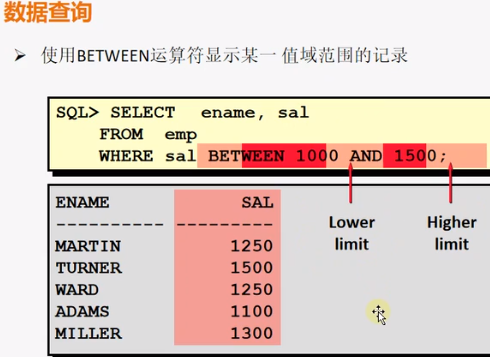
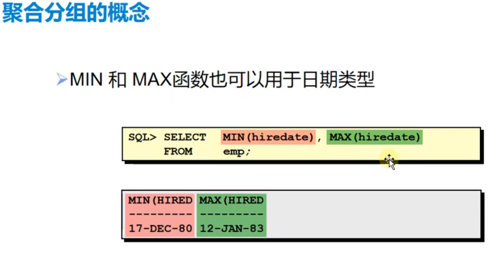
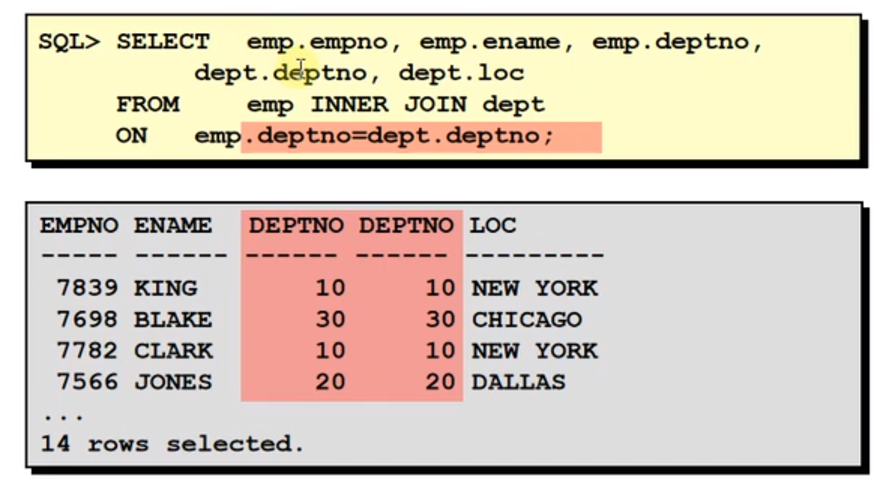

# 数据库My SQL基础

## 一、安装My SQL（UOS）

### 1.下载MySQL：https://dev.mysql.com/downloads/

### 2.解压tar.gz 包

```undefined
tar -xvf mysql-8.0.20-linux-glibc2.12-x86_64.tar.xz 
```

### 3.重命名

```bash
mv mysql-8.0.20-linux-glibc2.12-x86_64/ mysql-8.0.20
```

### 4.复制到/usr/local

```bash
sudo mv mysql-8.0.20 /usr/local/
```

### 5.创建用户组

```undefined
sudo groupadd mysql
```

### 6.添加用户

```undefined
useradd -r -g mysql mysql
```

### 7.创建MySQL数据目录

```bash
sudo mkdir -p /data
cd data
sudo mkdir -p mysql
```

### 8.修改拥有者

```bash
sudo chown mysql:mysql -R /data/mysql
```

### 9.生成编辑配置文件

```bash
sudo vim /etc/my.cnf
[mysqld]
bind-address=0.0.0.0
port=3306
user=mysql
basedir=/usr/local/mysql-8.0.20
datadir=/data/mysql
socket=/tmp/mysql.sock
log-error=/data/mysql/mysql.err
pid-file=/data/mysql/mysql.pid
#character config
character_set_server=utf8mb4
symbolic-links=0
```

### 10.初始化MYSQL

```bash
cd /usr/local/mysql-8.0.20/
sudo ./mysqld --defaults-file=/etc/my.cnf --basedir=/usr/local/mysql-5.7.26/ --datadir=/data/mysql/ --user=mysql --initialize
```

### 11.查看初始密码

```bash
sudo cat /data/mysql/mysql.err 
```


### 12.启动mysql

1. service mysql start 出现问题
   Failed to start mysqld.service: Unit mysqld.service not found.
2. ps -ef|grep mysql 检查，确实没有相关进程启来
3. sudo find / -name mysql.server 查找
   
4. sudo cp /usr/local/mysql-8.0.20/support-files/mysql.server /etc/init.d/mysql
5. sudo /etc/init.d/mysql status
   
6. sudo service mysql status
   
   发现问题是因为权限问题导致的，服务进程没有问题

### 13.修改密码


```sql
alter user 'root'@'localhost' identified by '123456';
```


------


## 二、数据库的基本概念

### 1.学习数据库需要掌握的几个关键概念:

- ##### 数据库: 数据库由表、关系及操作对象组成

- ##### 表：表由行和列组成，由于my sql被称为关系型数据库，所以表又被称为关系（relation）

- ##### 字段:表中的列被称为字段

- ##### 记录:表中的行被称为记录

- ##### 约束(要求):约束就是管理，管理数据的完整性。

  - <u>**数据可靠性 + 数据准确性 = 数据完整性**</u>

  - 三大完整性：
    - 实体完整性
      - 列值要求(约束)：输入的类型是否正确？/输入的格式是否正确?/是否在允许的取值范围内？
      - 整行要求(约束):是否存在重复输入？/是否符合其他特定要求?
    - 参照完整性.
      - 外键约束:外键的值要求与主表的主键或者唯一键相对应，外键用来**<u>强制引用(参照)完整性</u></u>**
    - 自定义完整性:根据具体业务要求所设置的约束，使用的约束方法---><u>**存储过程、触发器。**</u>

- ##### 主键:表中有一列或者几列组合的值能用来唯一标识表中的每一行，这样的一列或者多列的组合叫做表的主键。

  - 主键选择的原则：
    - 最少性：尽量选择单个字段作为主键
    - 稳定性：尽量选择数值更新少的列作为主键
  - **<u>主键必须非空且唯一</u>**
  - <u>**一个表只能有一个主键，主键约束确保了表中的行是唯一的**</u>
  - 表中可以没有主键，但通常都应该为表设置一个主键

- ##### 外键(引用键)：

  ###### a.子表中对应于主表的字段(列)，在子表中被称为外键。

  ###### b.外键的值要求与主表的主键或者唯一键相对应，外键用来**<u>强制引用完整性</u></u>**。

  ###### c.一个表可以有多个外键。

- 举例：成绩表中的课程ID和学号都是外键，同时也是成绩表的组合主键(联合主键)

  - 学生表

    | 学号（主键） | 姓名 | 性别 | 年龄 | 专业 | 家庭住址 | 联系方式 |
    | :----------: | :--: | ---- | ---- | ---- | -------- | -------- |
    |     001      |  XX  | 男   | 18   | A    | XXXXXXX  | 123456   |

  - 课程表

    | 课程ID（主键） | 课程名称 | 授课老师 | 所属专业 |
    | -------------- | -------- | -------- | -------- |
    | A1             | 语文     | XXX      | A        |

  - 成绩表

    | 课程ID | 学号 | 成绩 |
    | ------ | ---- | ---- |
    | A1     | 001  | 80   |
    | A1     | 002  | 75   |
    | A2     | 001  | 86   |


### 2.常见的关系型数据库

- SQL Server: 一般学校学习使用
- My SQL：互联网企业常用
- Oracle：付费数据库，更专业，大型金融公司使用
- DB2: 付费数据库，更专业，大型金融公司使用
- SQLite: 轻量数据库，多用于手机

### 3.常见的非关系型数据库

`非关系型数据库不是以表的形式保存，而是以键值对的形式保存。`

- MongoDB
- Redis

------


## 三、结构化查询语句SQL

### 1.SQL定义


### 2.SQL语句的分类

|      语言分类       |                             名称                             |                        详细描述                        |
| :-----------------: | :----------------------------------------------------------: | :----------------------------------------------------: |
| 1.数据查询语句(DQL) |                            Select                            |                      数据选择查询                      |
| 2.数据操作语句(DML) |           Insert;<br />Update;<br />Delete;<br />            |             插入<br />更新<br />删除<br />             |
| 3.数据定义语句(DDL) | Create;<br />Alter;<br />Drop;<br />Rename;<br />Truncate;<br /> | 新建<br />改结构<br />删除<br />重命名<br />删除<br /> |
| 4.数据控制语言(DCL) |                     Grant;<br />Revoke;                      |                   授权<br />解除授权                   |

### 3.总结


------


## 四、管理数据库

### 1.创建和使用数据库

- #### 在大多数RDBMS中，我们都可以使用如下简单的SQL语句，创建整个数据库：

  ```sql
  CREATE DATABASE [IF NOT EXISTS] 数据库名
  ```

- #### 其中，数据库名必须在服务器中唯一，并且符合标识符规则。

  - ##### 标识符规则：数据库名必须以字母开头。中文也可以做表名和数据库名，但不建议这样做。

- #### 标识符不能是RDBMS的保留字(关键字)

- #### 不允许嵌入空格或其他特殊字符

### 2.SQL语句基本书写规则

- #### SQL语句要以`(;)`结尾，一条SQL语句对应一个操作，在RDBMS当中，SQL语句也是逐条执行的。

- #### SQL语句不区分大小写，例如，不管写成SELECT还是select，都是查询语句，表名和列名也是如此。通常我们遵循**<u>关键字大写</u>**、**<u>表名的首字母大写</u>**、其余小写的习惯。

- #### 字符串和日期值要用引号括起来，例如'abc','2022-04-03'这样的，但是数值型则无需引号，如：1、23等

- #### SQL语句之间的单词需要用半角空格或换行符分隔

  - ##### 如：CREATE TABLE Product，如果未加分隔会发生错误

### 3.创建表

- #### 创建表的基础SQL语法如下：

  ```sql
  CREATE TABLE 表名(
  	列名 数据类型 约束，
      列名 数据类型 约束，
  )[ENGINE=engine_name] [DEFAULT] CHARACTER SET[=]charset_name;
  ```

  - 其中表名在一个数据库中必须唯一且符合标识符规则。列名在一个表内必须唯一且符合标识符规则。列的数据类型决定了什么样的数据可以存储在列中，而列的约束定义了创建列时的限制条件。MySQL引擎类型(ENGINE)有InnoDB和MylSAM两种，目前一般5.4以上版本都是使用InnoDB。
  - 举例：

  ```sql
  CREATE TABLE Friend(
      Name VARCHAR(50),
      PhoneNumber VARCHAR(15)
  );
  CREATE TABLE demo(
      id INT,
      name VARCHAR(10)
                   )ENGINE=INNODB DEFAULT CHARACTER SET utf8;
  
  ```


- ### 连接到数据库

  - #### 新的数据库创建完毕后，为了在该数据库上执行SQL语句，我们需要先声明使用数据库：

    ```sql
    USE 数据库名;
    ```

  - #### 修改数据库编码集：

    ```sql
    ALTER DATABASE db_name CHARACTER SET= charset_name
    -- 例如
    ALTER DATABASE test CHARACTER SET= gb2312;
    ```

  - #### 注意:如果是在navicat中需要关掉数据库连接后重新打开查看数据库属性才能看到更改

  - #### 查看数据库

    ```sql
    SHOW DATABASES;
    ```

  - #### 删除数据库

    ```sql
    DROP DATABASE 数据库名;
    ```

### 4.数据类型


- #### CHAR(定长字符): 字符长度是一定的，如果字符串长度不足，将会以空格来补齐。例如char(10),实际存入字符hello，讲存储hello+5个空格符。

- #### VARCHAR(不定长字符): 字符串最长长度是一定的，但实际字符串长度是根据实际存入字符串来决定的，长度不足不会以空格补齐。例如varchar(10),实际存储的是hello，则存储的字符长度为5。


- 日期和时间类型举例：

  ```sql
  CREATE TABLE demo(
  	id INT auto_increment PRIMARY KEY,
  	reg_datetime DATETIME,
  	reg_time TIME,
  	reg_date DATE,
  	reg_year YEAR);
  
  INSERT INTO demo VALUES(1,'2022-04-03 16:41:30','16:41:30','2022-04-03','2022')
  ```


- 思考在创建表时，下列列一般定义为何种数据类型？
  - 姓名、地址、电话号码、身份证号: VARCHAR\VARCHAR\INT\INT
  - 年龄：INT
  - 出生日期：DATETIME\DATE
  - 照片：BLOB
  - 薪水：FLOAT

### 5.创建主键的几种方法

#### a.直接在字段定义后面声明主键

```sql
CREATE TABLE stu(
	id INT PRIMARY KEY,		-- 声明主键
	sname VARCHAR(5) NOT NULL,
	sex INT);
```

#### b.用constraint声明主键(**`主键命名规范： pk_表名`**)

- 代码如下：

```sql
CREATE TABLE stu(
	id INT,		
	sname VARCHAR(5) NOT NULL,
	sex INT,
	CONSTRAINT pk_stu PRIMARY KEY(id));	-- 声明主键
```

```sql
CREATE TABLE stu(
	id INT,		
	sname VARCHAR(5) NOT NULL,
	sex INT,
	PRIMARY KEY(id, sname));		-- 复合主键声明
```

#### c.用ALTER语句补充声明主键

```sql
ALTER TABLE stu ADD CONSTRAINT pk_stu PRIMARY KEY(id);
```

#### d.删除主键

```sql
ALTER TABLE stu DROP PRIMARY KEY;
```

### 6.创建外键

```sql
CREATE TABLE IF NOT EXISTS demo_new(
	cid INT PRIMARY KEY,
	sid INT,
	FOREIGN KEY(sid) REFERENCES demo(sid));	-- 创建外键约束声明
```

#### a.指定外键删除或更新的行为


```sql
CREATE TABLE IF NOT EXISTS demo_new(
	cid INT PRIMARY KEY,
	sid INT,
	FOREIGN KEY(sid) REFERENCES demo(sid) ON UPDATE CASCADE);	-- 创建外键约束声明
```

```sql
CREATE TABLE IF NOT EXISTS demo_new(
	cid INT PRIMARY KEY,
	sid INT,
	FOREIGN KEY(sid) REFERENCES demo(sid) ON UPDATE CASCADE ON DELETE CASCADE);	
```

```sql
CREATE TABLE IF NOT EXISTS demo_new(
	cid INT PRIMARY KEY,
	sid INT,
	FOREIGN KEY(sid) REFERENCES demo(sid) ON UPDATE CASCADE ON DELETE RESTRICT);	
```

#### b.通过constraint添加外键

```sql
ALTER TABLE demo_new ADD CONSTRAINT fk_demo_new FOREIGN KEY(sid) REFERENCES demo(sid) ON DELETE CASCADE ON UPDATE CASCADE;
-- 设置外键约束时，主表的键需要是主键,否则无法设置
```

#### c.删除外键约束

```sql
ALTER TABLE 表名 DROP FOREIGN KEY 外键名;
-- 注意外键名！=字段名，删除外键前需要先查出对应的外键名，使用SHOW CREATE TABLE 表名进行查询,举例:
-- 绑定demo 的id和demo_new 的id 作为demo_new 的外键id，此时demo_new的外键名查询出来为fk_demo_new。
ALTER TABLE demo_new ADD CONSTRAINT fk_demo_new FOREIGN KEY(id) REFERENCES demoid) ON DELETE CASCADE ON UPDATE CASCADE; 
```

### 7.创建自增长约束


```sql
CREATE TABLE demo(
	-- 设定为自增长的列必须设置为主键，并且一张表里只能有一个自增列
	ID INT AUTO_INCREMENT PRIMARY KEY,
	name VARCHAR(10));

INSERT INTO demo VALUES(3, 'tester1');
INSERT INTO demo(name) VALUES('tester2'); -- 没有指定主键的值则会自动增长
```

### 8.创建唯一约束


```sql
CREATE TABLE demo(
	vip VARCHAR(50) UNIQUE, -- 唯一约束
);
-- 如果传入重复的数值会报错:> 1062 - Duplicate entry 'vip' for key 'vip'
```

### 9.创建非空约束


```sql
CREATE TABLE demo(
	name VARCHAR(50) NOT NULL,	-- 非空约束
);
```

### 10.创建检查约束


```SQL
CREATE TABLE demo(
	sex SET('男', '女'),	-- 检查约束SET or ENUM
	payment ENUM('货到付款', '在线支付'));
```

```sql
-- 举例
CREATE TABLE demo(
	-- 设定为自增的列必须设置为主键，且一张表里只有一个自增列
	ID INT AUTO_INCREMENT PRIMARY KEY,
	name VARCHAR(10) NOT NULL,
	sex SET('男', '女'));

INSERT INTO demo VALUES(DEFAULT, 'tester1', '女');	-- 自增的列设置为DEFAULT会自动序列号+1处理
```

### 11.创建默认值约束


```sql
CREATE TABLE demo(
	tel VARCHAR(50) DEFAULT '15888888888');
```

### 12.常见语法错误

- ### 自增长列不能设置默认值

  ```sql
  ID INT AUTO_INCREMENT PRIMARY KEY DEFAULT 0 
  -- 报错：1067 - Invalid default value for 'ID'
  ```

  

- #### 默认值和唯一约束不能同时设置

  ```sql
  NAME VARCHAR(50) UNIQUE DEFAULT '123456'
  ```

- #### 外键不能像主键一样定义

  ```sql
  UID INT FOREIGN KEY	-- 报错：> 1064 - You have an error in your SQL syntax; check the manual that corresponds to your MySQL server version for the right syntax to use near 'FOREIGN KEY,
    )' at line 2
  ```

- #### 少了连接关键字

  ```sql
  UID INT,
  FOREIGN KEY(uid) 主表(uid)	-- 报错:1064
  ```

### 13.管理数据库中的表

- #### 查看数据库中的所有表

  ```sql
  USE DATABASE 数据库名;
  SHOW TABLES;
  ```

- #### 查看表的定义

  ```sql
  USE DATABASE 数据库名;
  SHOW CREATE TABLE 表名;
  ```

  - #### 举例（输入可将CREATE TABLE 列中的值拷贝出来，可以看到创建表时的代码）

  

- #### 删除表

  ```sql
  USE DATABASE 数据库名;
  DROP TABLE 表名;
  ```

  - #### 注意：通过外键约束连接在一起的表不能被删除，在删除表之前必须先删除约束。在删除表时，我们必须是表的所有者或者对该表有管理员权限。

- ### 复制表

  - #### 复制表的结构和表中的数据(数据结构、约束、表中的数据值等)

    ```sql
    CREATE TABLE 新表名 AS SELECT * FROM 被复制表名;
    -- 例如：
    CREATE TABLE demo1 AS SELECT * FROM demo;
    ```

    

  - #### 只复制表的结构，不复制数据

    ```sql
    CREATE TABLE 新表名 LIKE 被复制表名;
    -- 例如：
    CREATE TABLE demo2 LIKE demo;
    ```

- ### 修改表名

  ```sql
  ALTER TABLE 表名 RENAME [TO|AS] 新的表名;
  -- 例如： 
  ALTER TABLE stu RENAME TO student;
  ```

- ### 添加列

  ```sql
  ALTER TABLE 表名 ADD COLUMN 列的定义(列名 数据类型 约束);
  -- 例如：
  ALTER TABLE Product ADD COLUMN product_name VARCHAR(100);
  ALTER TABLE demo1 ADD COLUMN comment VARCHAR(10) NOT NULL;
  ```

- ### 更改列名以及类型

  ```sql
  ALTER TABLE 表名 CHANGE [COLUMN] 原列名 新列名 列定义;
  -- 例如：
  ALTER TABLE student CHANGE COLUMN stu_name sname VARCHAR(20)
  ```
  
  ```sql
  ALTER TABLE 表名 MODIFY [COLUMN] 列名 列类型; -- 只修改列类型
  -- 例如:
  ALTER TABLE student MODIFY COLUMN sname VARCHAR(10);
  ```

- ### 删除列

  ```sql
  ALTER TABLE 表名 DROP [COLUMN] 列名;
  -- 例如：
  ALTER TABLE student DROP COLUMN sname;
  ```

### 14.总结


------


## 五、使用DML语句操作表中的数据

### 1.Inset插入单数据行

```sql
CREATE TABLE Students(
	SCode INT auto_increment PRIMARY KEY,
	SName VARCHAR(10) NOT NULL,
	SAddress VARCHAR(10) NOT NULL,
	SGrade INT,
	SEmail VARCHAR(20),
	SSex INT);

-- INSERT INTO 表名(列名列表) VALUES值列表);
INSERT INTO Students(SName, SAddress, SGrade, SEmail, SSex) VALUES'张三', '上海松江',6 'ZS@Sohu.com', 0);
```

#### 


### 2.Insert插入多行记录

```sql
INSERT INTO 表名(列名列表) VALUES值列表),(值列表)....
-- 举例
INSERT INTO Students(SName, SGrade, SSex) VALUES 
('张三',7,1),
('张四',4,0),
('张五',2,1);		-- 最后一行记录用;号结束
```

### 3.Update更新数据行

```sql
UPDATE 表名 SET 列名=更新值 [WHERE 更新条件];
-- 举例
UPDATE Students SET SSex = 0;	-- 不带WHERE 控制条件，会更新整个表的SSex列下的记录值为0
UPDATE Students SET SAddress = '重庆' WHERE SAddress = '上海松江';

UPDATE Students SET SGrade = SGrade + 5 WHERE SGrade <= 10;

```

### 4.DELETE删除数据行

```sql
DELETE FROM 表名 [WHERE 删除条件];
-- 举例
DELETE FROM Studens;	-- 注意，不带删除条件会删除整个表的数据记录，一般不要这么做。
DELETE FROM Studens WHERE SName = '张三';
```


```sql
-- 举例
START TRANSACTION;	-- 开始事务
SELECT * FROM Students;
DELETE FROM Studens;
SELECT * FROM Students;
-- COMMIT;			-- 提交事务，在这里提交了事务等同于直接执行了TRUNCATE TABLE Students;
ROLLBACK;			-- 事务回滚，只能用作于事务未提交时进行回滚
SELECT * FROM Students;
```

### 5.总结

### `DML语句会操作表中的数据，但不会影响表本身`

```sql
-- 举例：
DELETE FROM Students;	-- 删除表中所有数据记录
DROP TABLE Students;	-- 直接删除这个表
```


------


## 六、DML语句中的SELECT(查询语句)

### 1.什么是查询？

### 

### 2.怎么查询？

```sql
SELECT 列名 FROM 表名 [WHERE 查询条件表达式] [ORDER BY 排序的列名 [ASC 或者 DESC]]
-- 举例
SELECT SCode, SName, SAddress From Students
WHERE SSex = 0
ORDER BY Scode -- 默认是 ASC 从小到大， DESC从大到小
```

- #### SQL 语句大小写不敏感

- #### SQL 语句可写成一行或多行

- #### 一个关键字不能跨多行或缩写

- #### 子句通常位于独立行，便于编辑并易读

- #### 空格和缩进使程序易读

- #### 关键字大写，其他小写

### 3.数据查询基本语法

#### a.所有列查询----*号查询


```sql
SELECT * FROM 表名;
-- 举例
SELECT * FROM dept;
```

#### b.指定列查询


```sql
SELECT 列名列表 FROM 表名;
-- 举例
SELECT deptno, loc FROM dept;
```

#### c.数值查询----算数表达式

- #### 对**<u>数值型数据</u>**可以使用算数运算创建表达式(+,-,*,/)


```sql
-- 举例
SELECT ename, sal, sal+300 FROM emp;
```

- ##### 乘法和除法的优先级高于加法和减法

- ##### 同级运算的顺序是从左到右

- ##### 表达式中使用括号可强行改变优先级运算顺序

#### d.空值查询


```sql
-- 举例
SELECT ename, job, comm FROM emp;
```

- #### 包括空值的算法表达式等于空值

  

  ```sql
  SELECT ename NAME, 12*sal+comm "年薪+补助" FROM emp
  WHERE ename = 'KING';
  ```

#### e.重命名查询----定义列的别名

- #### 改变列的标题title

- #### 使用计算结果

- #### 列的别名

- #### 如果使用特殊字符，或大小写敏感或有空格时，需加**<u>引号</u>**


```sql
SELECT 列名 [AS] 列的别名, 列名 [AS] 列的别名 FROM 表名;
-- 举例
SELECT ename AS 姓名, sal AS 薪资 FROM emp;
SELECT ename "Name", sal*12 "Annual Salary(年终奖)" FROM emp;	
-- 特殊字或者带空格需要加引号
```

#### f.排除重复查询----DISTINCT关键字

- #### 缺省情况下查询显示所有行包含重复行


```sql
-- 举例
SELECT deptno FROM emp;
```

- #### 使用DISTINCT关键字删除重行


```sql
SELECT DISTINCT 列名 FROM 表名;
-- 举例
SELECT DISTINCT deptno FROM emp;
```

- #### 使用DISTINCT关键字查询多列排除重复时, 会返回多列组合时没有重复的情况

  

  ```sql
  -- 举例
  SELECT DISTINCT empno, mgr FROM emp;
  ```

#### g.限制行数查询----LIMIT关键字


```sql
SELECT 列名 FROM 表名 LIMIT [offset,] count;	-- offset参数默认值为0,可以不填代表从第一行开始
-- 举例
SELECT * FROM emp LIMIT 5,6;	-- 从偏移量为5的行开取6行，偏移量为5代表第6行(注意第一行偏移量为0)
SELECT * FROM emp LIMIT 5;	-- 等同于SELECT * FROM emp LIMIT 0,5;
SELECT * FROM emp ORDER BY sal DESC LIMIT 3;	-- 求工资最高的前三个员工信息
SELECT * FROM emp ORDER BY sal DESC LIMIT 3,1;	-- 求工资第四高的员工信息
```

#### h.数据条件查询----WHERE关键字


```sql
SELECT [DISTINCT] 列名列表 FROM 表名 [WHERE 条件表达式];
```


```sql
-- 举例
SELECT ename, job, deptno FROM emp WHERE Job='CLERK';
```

- #### 注意，在where子句中字符串和日期要用**<u>单引号</u>**扩起来。

  ```sql
  -- 举例
  SELECT * FROM emp WHERE hiredate > '1981-04';
  SELECT * FROM emp WHERE ename = 'KING';
  ```

- #### 常见条件运算符

  - #### 大于/等于/小于 运算符

  

  

  ```sql
  -- 举例
  SELECT ename, sal, comm FROM emp
  WHERE sal<=comm;
  ```

  

  - #### 匹配返回运算符

    

    

    ```sql
    -- 举例
    SELECT ename, sal FROM emp WHERE sal BETWEEN 1000 AND 1500;
    ```

    

    

    ```SQL
    -- 举例
    SELECT empno, ename, sal, mgr FROM emp WHERE mgr IN (7902,7566,7788);
    ```

    

    

    ```sql
    -- 举例
    SELECT ename FROM emp WHERE ename LIKE 'S%';	-- S%表示以S开头的字符
    ```

    

    

    ```sql
    -- 举例
    SELECT ename FROM emp WHERE ename LIKE '_A%';	-- _A%表示第二个字符为A的字符
    ```

    

    

    ```sql
    -- 举例
    SELECT ename，mgr FROM emp WHERE mgr IS NULL;
    ```

    

  - #### AND/ OR / NOT 运算符

    

    ```sql
    -- 举例
    SELECT empno, ename, job, sal FROM emp
    WHERE sal>=1000
    AND job='CLERK';
    ```

    

    

    ```SQL
    -- 举例
    SELECT empno, ename, job, sal FROM emp
    WHERE sal>=1100
    OR job='CLERK';
    ```

    

    

    ```sql
    -- 举例
    SELECT ename, job FROM emp
    WHERE job NOT IN ('CLERK','MANAGER','ANALYST');
    ```

    

    

    

    ```SQL
    -- 举例
    SELECT ename, job, sal FROM emp
    WHERE (job='SALESMAN' OR job='PRESIDENT')
    AND sal>1500;
    ```

#### i.排序查询----ORDER BY关键字


- #### 使用升降序关键字排列(ASC/DESC)

  

```sql
-- 举例
SELECT ename, job, deptno, hiredate FROM emp
ORDER BY hiredate DESC;		-- 降序排列

SELECT ename, job, deptno, hiredate FROM emp
ORDER BY hiredate ASC;		-- 升序排列
```


- #### 使用列的别名排序

  

```SQL
-- 举例
SELECT empno, ename, sal*12 annsal FROM emp
ORDER BY annsal;	-- 使用别名排序
```


- #### 通过多列进行排序

  

  ```sql
  --举例
  SELECT ename, deptno, sal FROM emp
  ORDER BY deptno ASC, sal DESC;
  ```

### 4.数据查询总结


### 5.聚合分组查询

#### a.聚合分组的概念


#### b.常用聚合函数


```sql
SELECT [COUNT, SUM, AVG, MAX, MIN]计数规范 FROM 表名
```


- #### 数字类型数据使用AVG和SUM函数

  

  ```sql
  -- 举例
  SELECT AVG(sal), MAX(sal), MIN(sal), SUM(sal) FROM emp
  WHERE job LIKE 'SALES%';
  ```


- #### MIN和MAX函数也可用于日期类型

  

  ```sql
  -- 举例
  SELECT MIN(hiredate), MAX(hiredate) FROM emp;
  ```


- #### COUNT(*)所有列名返回表中的记录数

  

  ```sql
  -- 举例
  SELECT COUNT(*) FROM emp WHERE deptno = 30;
  ```

  - #### 聚合分组函数会省略列中的空值, 返回非空记录数

    

    ```sql
    -- 举例
    SELECT COUNT(comm) FROM emp
    WHERE deptno=30;
    ```

    

    

    ```sql
    -- 举例
    SELECT AVG(comm) FROM emp;		-- 算出来的平均值不含空值，数值并不准确
    ```

  

  - #### IFNULL函数强制分组函数包括空值

    

    ```sql
    -- 举例
    SELECT AVG(IFNULL(comm,0)) FROM emp;	-- 如果comm的值为NULL就返回0
    ```


#### c.分组函数----group by

- #### 概念

  

  

  

  ```sql
  -- 举例
  SELECT deptno, AVG(sal) FROM emp
  GROUP BY deptno;
  ```

  

- ### 注意，MySQL中，SELECT后出现了聚合函数，则该位置只能出现其他聚合函数和分组依据列，普通列的查询只会显示第一行值，毫无意义，其他数据库有些甚至不支持该行为，建议不要这么做。


#### d.多列分组函数


```sql
-- 举例
SELECT deptno, job, sum(sal) FROM emp GROUP BY deptno, job;
```


#### f.限定分组结果----HAVING关键字


```sql
-- 举例
SELECT deptno, max(sal) FROM emp
GROUP BY deptno
HAVING max(sal)>2900;		-- 当条件是分组聚合函数时，使用HAVING关键字
```


```sql
-- 举例
SELECT job, SUM(sal) PAYROLL FROM emp
WHERE job NOT LIKE 'SALES%'
GROUP BY job
HAVING SUM(sal)>5000
ORDER BY SUM(sal);
```


#### g.分组查询与条件查询对比


#### h.嵌套组函数


```sql
-- 举例
SELECT MAX(AVG(sal)) FROM emp
GROUP BY deptno;		-- 先执行求平均值，再过滤平均值中最大的列记录
```


### 6.聚合分组查询总结


- #### 思考题

  

  ```sql
  -- 举例
  SELECT A1,B1,MAX(C1) FROM A
  -- 结果
  -- A1  | B1 | C1
  -- 1001| P1 | 100
  ```


### 7.关系型数据库SQL语句执行顺序


- #### FROM --> [WHERE] --> [GROUP BY] --> SELECT --> [HAVING] --> [ORDER BY] --> LIMIT


### 8.子查询

#### a.什么是子查询?


#### b.子查询语法


```sql
SELECT 列名, 列名... FROM 表名
WHERE （SELECT 列名列表 FROM 表名）;
```


```sql
-- 举例
SELECT ename FROM emp
WHERE sal > (SELECT sal FROM emp WHERE empno=7566);
```

#### c.子查询的规则

- #### 子查询要用括号括起来

- #### 将子查询放在比较运算符的右边

- #### 子查询中不要加ORDER BY 子句

- #### 对单行子查询使用单行运算符

- #### 对多行子查询使用多行运算符

#### d.子查询的种类


- #### 单行子查询

  

  

  ```sql
  -- 举例
  SELECT ename, job
  FROM emp
  WHERE job=(SELECT job FROM emp
            WHERE empno=7369)
  AND sal > (SELECT sal FROM emp
            WHERE empno=7876);
  ```


- #### 错误的子查询（多行子查询使用单行运算符）

  


- #### 多行子查询

  

  - #### 多行子查询中使用IN 运算符

    

    ```sql
    -- 举例
    SELECT empno, ename, job, sal FROM emp
    WHERE deptno IN (SELECT deptno FROM emp
                    WHERE ename='SMITH' OR ename='MILLER');
    ```

  

  - #### ANY多行子查询

    

    ```sql
    SELECT empno, ename, job FROM emp
    WHERE sal > ANY (SELECT sal
                    FROM emp
                    WHERE job='CLERK');
    ```

  

  - #### ALL多行子查询

    

    ```sql
    -- 举例
    SELECT empno, ename, job, sal
    FROM emp
    WHERE sal > ALL (SELECT AVG(sal)
                    FROM emp
                    GROUP BY deptno);
    ```

    

#### e.子查询中使用聚合函数


```sql
-- 举例
SELECT ename, job, sal
FROM emp
WHERE sal=(SELECT MIN(sal)
          FROM emp);
```


#### f.HAVING语句中使用子查询结果


```sql
-- 举例
SELECT deptno, MIN(sal)
FROM emp
GROUP BY deptno
HAVING MIN(sal) > (SELECT MIN(sal)
                  FROM emp
                  WHERE deptno=20);
```


#### g.子查询总结


### 9.多表查询

#### a.为什么要进行表连接？


#### b.多表连接的主要类型

- #### 内连接(INNER JOIN)

- #### 外连接

  - #### 左外连接(LEFT JOIN)

  - #### 右外连接(RIGHT JOIN)

#### c.内连接(INNER JOIN)


```SQL
SELECT 表名1.列名, 表名2.列名
FROM 表1,表2
WHERE 表1.列名 = 表2.列名;

SELECT 表名1.列名, 表名2.列名
FROM 表1 INNER JOIN 表2
ON 表1.列名 = 表2.列名;
```


- ### 内连接必须指定连接条件, 否则会造成笛卡尔积结果(查询数据冗余无效)

  

  


- #### 内连接范例

  

  ```sql
  -- 举例
  SELECT emp.empno, emp.ename, emp.deptno, dept.deptno, dept.loc
  FROM emp INNER JOIN dept
  ON emp.deptno = dept.deptno;
  ```


- #### 内连接等值写法(不含INNER JOIN 关键字)

  

  ```sql
  -- 举例
  SELECT emp.empno, emp.ename, emp.deptno, dept.deptno, dept.loc
  FROM emp, dept
  WHERE emp.deptno=dept.deptno;
  ```


- #### 使用别名简化查询

  - #### 多表连接中限定列名

  - #### 使用表名作为前缀在多个表中指定列名

  - #### 使用表前缀可以改进性能

  - #### 使用列的别名以区分不用表的同名列

  

  ```sql
  -- 举例
  SELECT e.empno, e.ename, e.deptno, d.deptno, d.loc
  FROM emp e, dept d
  WHERE e.deptno=d.deptno;
  ```


- #### 在多表连接中设置过滤条件

  

  ```sql
  -- 举例
  SELECT emp.empno, emp.ename, emp.deptno, dept.deptno, dept.loc
  FROM emp INNER JOIN dept
  ON emp.deptno=dept.deptno AND emp.ename='KING';
  ```


#### d.外连接(LEFT JOIN&RIGHT JOIN)


```SQL
-- 举例
SELECT emp.ename, dept.deptno
FROM dept LEFT JOIN emp
ON emp.deptno=dept.deptno;
```


#### e.多表连接查询总结


### 10.