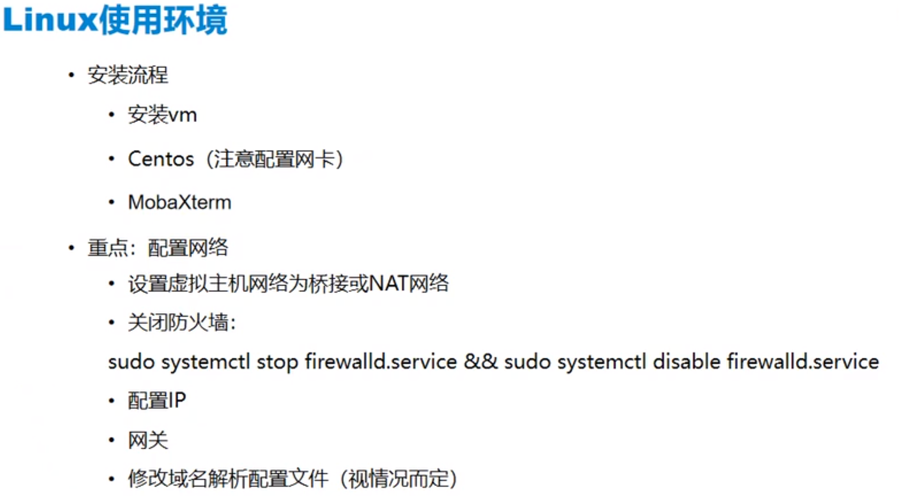
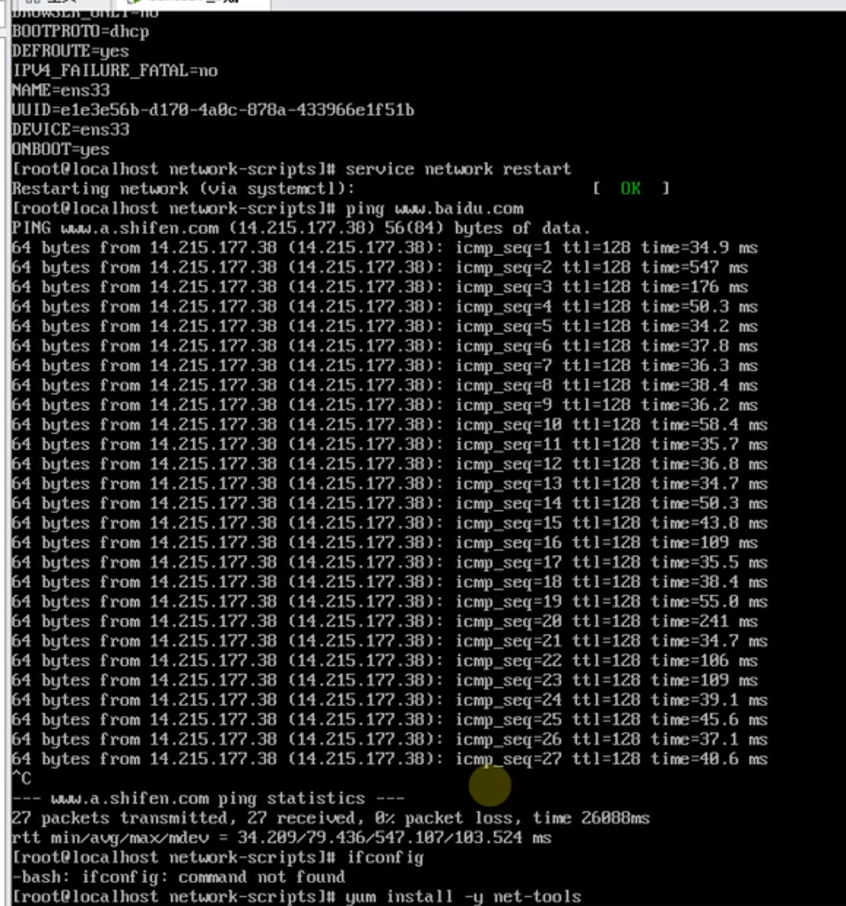
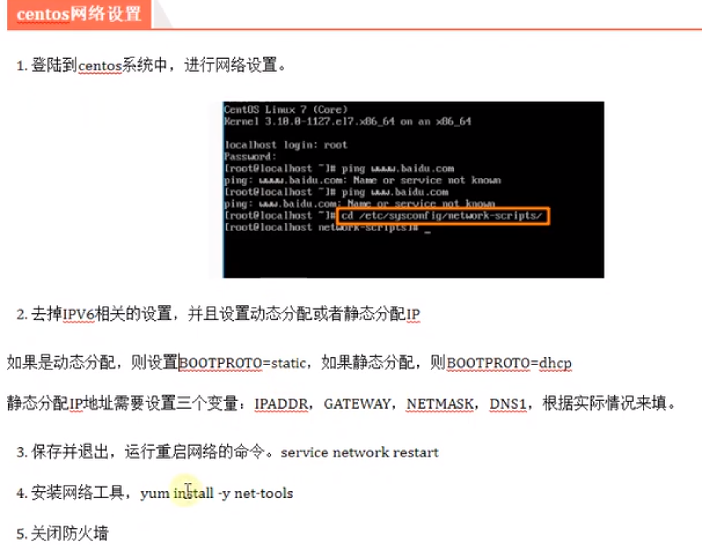
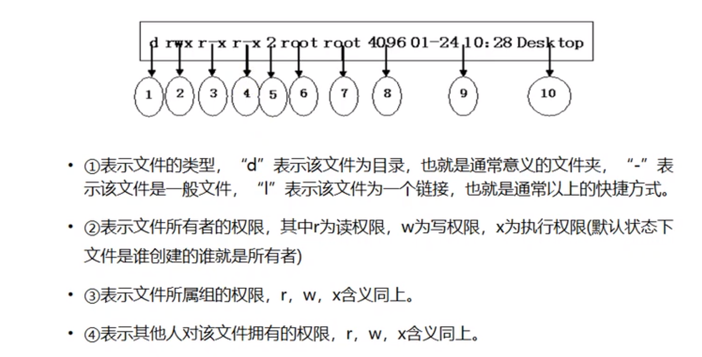
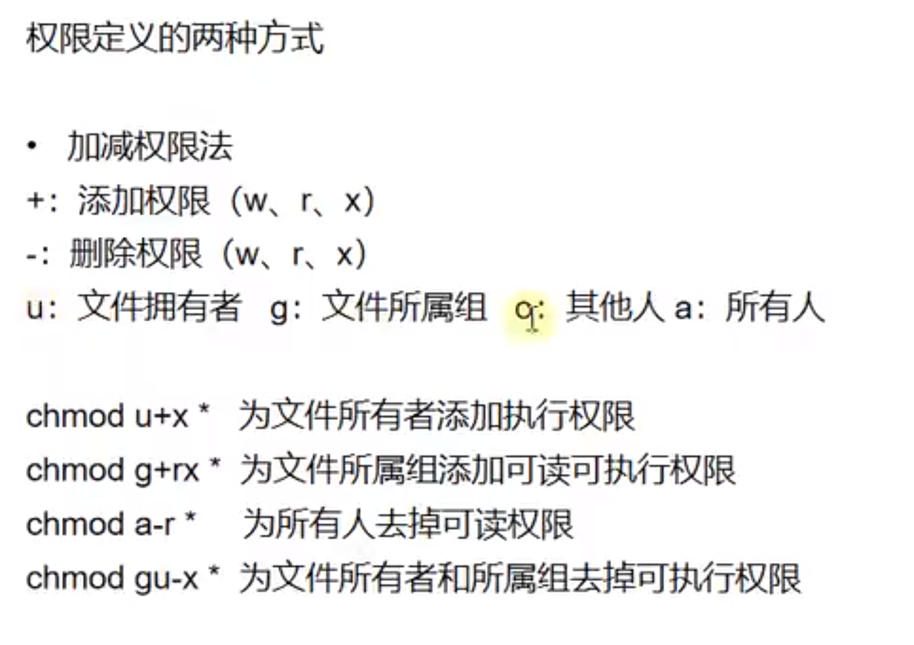

# 一、Linux环境配置

## 1.安装Linux系统所需要的环境

- ### VMware Workstation - 虚拟机

  #### 安装教程:https://blog.csdn.net/hao5119266/article/details/89198275

- ### CentOS - Linux发行版之一

  #### 安装教程:https://blog.csdn.net/qq_44714603/article/details/88829423

- ### MobaXterm - 远程安全终端

## 2.安装流程



## 3.配置网络





## 4.(重要！！！)配置完成后，使用虚拟机快照功能，保存还原点

------


# 二、Linux常用指令

## 1.目录管理

### a.常用目录

- #### / : 整个系统的根目录，目录树的起点

- #### /home :  包含用户的文件，包括参数设置文件、个性化文件、文档、数据、EMAIL、缓存数据等

- #### /mnt : 软盘、光盘、U盘等外设的预设挂载点

- #### /tmp : 临时文件，该目录一般会定期被系统自动清理干净

- #### /opt : 可选的应用程序，一般我们自己装的软件，可以放到这个目录下


### b.目录管理基本操作指令

- #### [Up键]和[Down键]可以滚动以前使用过的命令

- #### [Tab键]可以把已输入部分的文件名、命令的剩余部分补全

- #### . 代表当前目录

- #### .. 代表上一层目录

- #### cd(change directory) : 改变目录，进入某个路径(注意相对路径和绝对路径)

- #### pwd : 打印当前的目录的绝对路径

- #### ls : 显示当前目录下文件


### c.目录管理常用操作指令

- #### mkdir : 创建一个目录

  ```
  # 命令用法
  mkdir test
  
  # 常用参数 -p 如果父目录不存在则自动创建父目录，方便创建多级目录
  mkdir -p demo/demo1/demo2
  ```

  

- #### mv : 重命令目录、文件、文件剪切

  ```
  # 命令用法
  # 命令后跟的是文件名，则重命名
  mv demo demo1 
  
  # 命令后跟的是路径，则实现剪切功能
  mv demo1 /tmp
  ```

  

- #### cp: 文件/目录拷贝，可结合通配符*使用

  ```
  # 命令用法
  cp 1.txt /tmp
  cp test*.txt /tmp
  
  # 如果是个文件夹需要拷贝，需要加参数-r,否则无法拷贝目录
  cp -r demo /tmp
  ```

  

## 2.文件管理

### a.文档编辑

- #### vi : 文件编辑命令(如果文件存在就打开文件，不存在会创建一个新文件并打开) 

  ```
  # 命令用法
  # 打开一个文件
  vi test.txt
  
  # 进入编辑模式: 键盘i
  # 退出编辑模式: 在编辑模式下按ESC键
  
  # 进入命令模式(非编辑模式下): 键盘上的: 号键
  # 搜索内容: 在命令模式下输入 /搜索内容
  # 强制退出(不保存): :q!
  # 退出并保存: :wq
  # 退出: :q
  # 保存: :w
  ```


### b.删除文件/目录

- #### rm : 删除文件/目录，可结合通配符*使用

  ```
  # 命令用法
  rm test.txt
  
  # rm -i 与rm作用相同，删除时会提示是否删除
  -r参数: 删除目录
  -f参数: 强制删除，不会提示
  
  # 著名删库跑路代码: rm -rf /
  ```


### c.创建空白文件

- #### touch

  ```
  # 命令用法
  touch text.txt
  touch test1.txt test2.txt test3.txt
  ```


### d.查找文件

- #### find : 遍历当前或整个文件系统来查找文件或目录

  ```
  # 命令格式
  find 路径名 -options [-print -exec -ok]
  # 查找文件
  find /home -name "test*)"
  
  # 在当前路径下查找文件类型名字带test的文件
  find . -type f -name "test*"	
  
  # 查找文件夹类型
  find. -type d -name "test*"
  
  # 查找文件并执行命令
  find . -type d -name "test*" -exec ls -l {} \;
  
  # 查找并删除文件(无确认)
  find . -type f -name "test*" -exec rm {} \;
  # 查找并删除文件(有确认)
  find . -type f -name "test*" -ok rm {} \;
  
  find /etc -name "pass*" -exec grep "root" {} \; 
  
  # 常用参数
  -name：按照文件名查找
  -type: 按照文件类型进行查找
  -perm: 按照文件执行权限进行查找
  
  # 查找当前路径权限为644的文件
  find . -perm 644
  ```


- #### grep :  完成对文本文件内容的模式查找，模式查找即正则表达式查找

  ```
  # 命令格式
  grep 查找模式
  
  # 常用参数
  -c 只输出匹配行的计数： grep -c 1998 data.f
  -i 不区分大小写(只适用于单字符): grep -i sept data.f
  -h 查询多文件时不显示文件名: grep -h sept data*
  -l 查询多文件时只输出包含匹配字符的文件名: grep -l sept data*
  -n 显示匹配行及行号: grep -n -i sept data.f
  -v 显示不包含匹配文本的所有行: grep -v sept data.f
  ```


- #### whereis : 查找系统文件的位置，通常用于系统自带二进制文件，普通文件应使用find

  ```
  # 命令格式
  whereis 文件名
  whereis python
  ```


- #### which : 跟whereis类似，一般用于查找环境变量$PATH中指定的目录里符合条件的文件，常用来查找可执行命令

  ```
  # 命令格式
  which 文件名
  
  which python
  ```

  

### e.显示文件内容

- #### cat : 显示文件内容

  ```
  # 命令格式
  cat 文件名
  
  # 常用参数
  -n : 对所有输出行进行编号
  -b : 与n类似，但空白行不编号
  -v : 显示控制字符
  ```


- #### head/tail : 从文件的首/尾进行查看

  ```
  # 命令格式
  head 文件名
  tail 文件名
  
  head -n 5 /etc/passwd
  tail -n 4 /etc/passwd
  
  # 参数
  -n 指定显示行数
  ```


- #### more : 分页显示文件内容

  ```
  # 命令用法
  more 文件名
  
  # 从第三行开始每页显示3行内容
  more -3 +3 /etc/passwd
  
  # 常用参数
  -num : 每页显示多少行内容
  +num : 从多少行开始显示
  ```

  

## 3.权限管理

### a.Linux中将文件的权限分为只读、可写、执行三种，分别以r(read)、w(write)、x(execute)表示




### b.权限定义的两种方式----数字表示法


### c.权限定义的两种方式----加减权限法



### d.修改权限

- ### chmod: 修改文件/文件夹权限

  ```
  # 命令格式
  chmod [-R] 权限 文件名/路径名
  ```


- ### chgrp: 修改文件/文件夹所属用户组的权限

  ```
  # 命令格式
  chgrp [-R] 组名 文件夹名/路径名
  ```


- ### chown: 修改文件/文件夹文件所有者的权限

  ```
  chown [-R] 用户名 文件名/路径名
  ```


## 4.系统设置及网络通信相关

### a. 显示字符串或将字符内容写入文本

- #### echo : 显示字符串或将字符内容写入文本

  ```
  # 命令格式
  echo 字符串内容
  echo "hello,world" test.txt
  
  # 常用参数
  -e 让字符串中含有的转义符生效
  ```


- #### > : 新建重定向

  ```
  > : 新建重定向
  >> : 追加重定向
  
  # 命令格式
  文本流 > 文件名
  文件流 >> 文件名	
  
  # 将当前目录下的所有文件详细信息写入test.txt
  ls -l > test.txt
  
  # 将当前目录下的所有文件详细信息追加写入test.txt
  ls -l >> test.txt
  
  ```


### b. 查看进程占用端口信息及进程id

- #### netstat : 查看进程占用端口信息及进程id

  ```
  # 常用命令
  netstat -apn | grep 端口名
  
  netstat -apn | grep 3306
  ```


### c.查看系统进程信息

- #### ps : 查看系统进程信息

  ```
  # 常用命令
  # 通过应用名称查找进程信息，一般关注进程ID
  ps -ef | grep tomcat
  ```


### d. 强制退出进程(杀死进程)

- #### kill : 通过进程id杀死对应进程，常用于强制退出程序

  ```
  kill -9 pid
  ```

  

## 5.备份压缩

### a.gzip(gz后缀)

```
# 常用命令
gzip 文件名: 压缩为gz后缀的文件(将对每个文件进行单独压缩，不是压缩到一起)

gzip -d xxx.gz : 解压缩xxx.gz文件
```


### b.tar(tar.gz后缀)

```
文件压缩: tar zcf 目标文件名.tar.gz 源文件
文件解压: tar zxf 目标文件名.tar.gz
```


### c.zip(zip后缀，需单独安装zip包)

```
# 安装zip包
yum install -y zip
yum install -y unzip

# 命令格式
压缩文件: zip xxx.zip 待压缩文件
压缩文件夹: zip -r xxx.zip
解压: unzip xxx.zip
```

------


# 三、RPM包的安装

## 1.安装rpm包: rpm -ivh xxx.rpm

## 2.卸载rpm包: rpm -e xxx.rpm

## 3.升级rpm包: rpm -uvh xxx.rpm