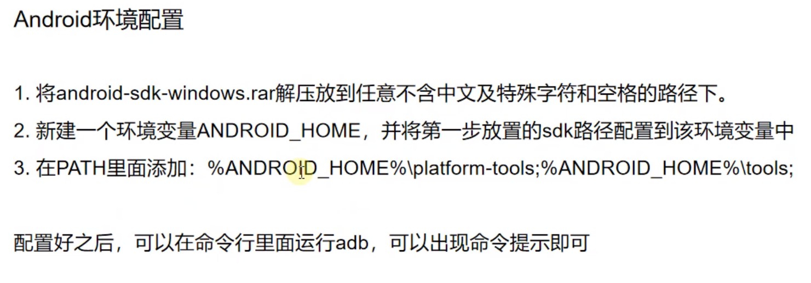
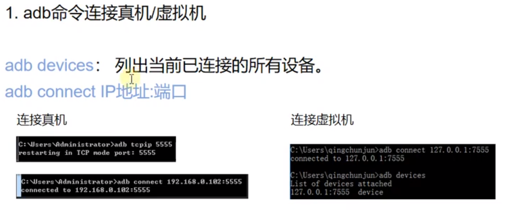

# 一、Java和Android环境的安装和配置

## 1. JAVA环境配置

- ### jdk下载地址:https://download.oracle.com/java


## 2. Android环境配置

- ### android-sdk下载地址: http://tools.android-studio.org/index.php/sdk



## 3.Android模拟器配置

- ### 模拟器下载地址: http://mumu.163.com

- ### 安装即可


------

# 二、ADB命令及工作原理

## 1.ADB命令原理

- ### ADB是Android Debug Bridge的简称，是android平台的调试工具。


## 2. ADB包含三个部分，Client端、Server端、Deamon守护进程

- ### Client端: 运行在开发机中，用于发送ADB命令

- ### Server端：运行在开发机中，用来管理Client和Deamon之间的通信

- ### Deamon守护进程：运行在调试设备中，手机或模拟器，用于接收并执行ADB命令


------

# 三、常用ADB命令

## 0.开启开发者选项并允许USB调试


## 1. adb命令连接真机/虚拟机



- ### adb devices : 列出当前已连接的所有设备

  - ### 未连接设备显示如下:

  

  - ### 已连接设备显示如下：

    

  

- ### adb connect + IP地址: 端口  ：连接指定IP地址

  


## 2.启动和停止adb server


- ### adb start-server ：启动ADB server(需要先停止ADB server)

  

- ### adb kill-server ：停止ADB server

  

- ### netstat -ano | findstr 5037 ： 查询adb端口的进程占用情况

  

  

- ### taskkill -f -pid 进程id ： 杀掉对应进程，释放adb端口

  


- ### 设计一个自动重启(断开并重连adb server)的bat脚本

  ```
  adb kill-server
  adb start-server
  adb connect 127.0.0.1:7555
  pause
  ```

  

## 3. 获取包名和activity名

- ### 包名（package name）：用于唯一标识一个app应用(注意包名不是应用名也不是apk的名字)

- ### activity名：在android中每个界面叫一个activity，获取activity其实就是获取界面名

- ### adb shell dumpsys window windows | findstr mFocusedApp : 获取当前显示的activity名

  


## 4.文件传输相关命令


- ### 从电脑发送文件到手机：adb push 电脑文件的路径名 手机文件夹路径(发送时可以更改文件名，也可以不更改)

  

- ### 从手机导出文件到电脑: adb pull 手机文件路径 电脑文件夹的路径

  


## 5.安装和卸载apk包

- ### adb install apk包路径：往默认连接的手机设备上安装apk(注意, apk文件名不能含有中文或特殊字符)

  

- ### adb install -r apk包路径：覆盖安装apk

  

- ### adb -s 127.0.0.1:7555 install apk包路径：往指定连接的设备安装apk

  

- ### adb uninstall **<u>包名</u>**：卸载程序

  


## 6. 查询本机所有的应用程序包

- ### adb shell pm list packages：本机所有应用程序包

  

- ### adb shell pm list packages -3：第三方应用程序包

  


## 7.查询apk的包名和启动activity的名称

### a. 有apk包的情况下，使用aapt工具查看(在android sdk路径下的build-tools文件夹下运行，也可以设置环境变量)

- ### aapt dump badging apk文件路径 | findstr package

  

- ### aapt dump badging apk文件路径 | findstr launch

  

### b.没有apk包的情况下，直接运行adb命令查看

- ### adb shell dumpsys activity activities | findstr Run(注意大小写)： 查看当前运行的App的界面信息

  

  


## 8. 截取当前界面

- ### adb shell screencap 照片保存地址(注意，只能写手机里的路径)

  


------

# 四、Appium介绍及环境配置

## 1.什么是Appium？


## 2. Appium工作原理


## 3. Appium环境搭建配置

### a. appium客户端

- ### 下载地址:https://github.com/appium/appium-desktop/releases

### b.appium-python库


### c.appium启动设置(注意管理员运行)


