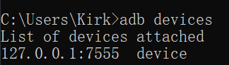
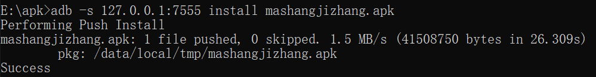
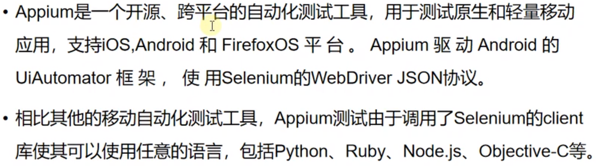

# 一、Java和Android环境的安装和配置

## 1. JAVA环境配置

- ### jdk下载地址:https://download.oracle.com/java


## 2. Android环境配置

- ### android-sdk下载地址: http://tools.android-studio.org/index.php/sdk


## 3.Android模拟器配置

- ### 模拟器下载地址: http://mumu.163.com

- ### 安装即可


------

# 二、ADB命令及工作原理

## 1.ADB命令原理

- ### ADB是Android Debug Bridge的简称，是android平台的调试工具。


## 2. ADB包含三个部分，Client端、Server端、Deamon守护进程

- ### Client端: 运行在开发机中，用于发送ADB命令

- ### Server端：运行在开发机中，用来管理Client和Deamon之间的通信

- ### Deamon守护进程：运行在调试设备中，手机或模拟器，用于接收并执行ADB命令


------

# 三、常用ADB命令

## 0.开启开发者选项并允许USB调试


## 1. adb命令连接真机/虚拟机


- ### adb devices : 列出当前已连接的所有设备

  - ### 未连接设备显示如下:

  

  - ### 已连接设备显示如下：

    

  

- ### adb connect + IP地址: 端口  ：连接指定IP地址

  


## 2.启动和停止adb server


- ### adb start-server ：启动ADB server(需要先停止ADB server)

  

- ### adb kill-server ：停止ADB server

  

- ### netstat -ano | findstr 5037 ： 查询adb端口的进程占用情况

  

  

- ### taskkill -f -pid 进程id ： 杀掉对应进程，释放adb端口

  


- ### 设计一个自动重启(断开并重连adb server)的bat脚本

  ```
  adb kill-server
  adb start-server
  adb connect 127.0.0.1:7555
  pause
  ```

  

## 3. 获取包名和activity名

- ### 包名（package name）：用于唯一标识一个app应用(注意包名不是应用名也不是apk的名字)

- ### activity名：在android中每个界面叫一个activity，获取activity其实就是获取界面名

- ### adb shell dumpsys window windows | findstr mFocusedApp : 获取当前显示的activity名

  


## 4.文件传输相关命令


- ### 从电脑发送文件到手机：adb push 电脑文件的路径名 手机文件夹路径(发送时可以更改文件名，也可以不更改)

  

- ### 从手机导出文件到电脑: adb pull 手机文件路径 电脑文件夹的路径

  


## 5.安装和卸载apk包

- ### adb install apk包路径：往默认连接的手机设备上安装apk(注意, apk文件名不能含有中文或特殊字符)

  

- ### adb install -r apk包路径：覆盖安装apk

  

- ### adb -s 127.0.0.1:7555 install apk包路径：往指定连接的设备安装apk

  

- ### adb uninstall **<u>包名</u>**：卸载程序

  


## 6. 查询本机所有的应用程序包

- ### adb shell pm list packages：本机所有应用程序包

  

- ### adb shell pm list packages -3：第三方应用程序包

  


## 7.查询apk的包名和启动activity的名称

### a. 有apk包的情况下，使用aapt工具查看(在android sdk路径下的build-tools文件夹下运行，也可以设置环境变量)

- ### aapt dump badging apk文件路径 | findstr package

  

- ### aapt dump badging apk文件路径 | findstr launch

  

### b.没有apk包的情况下，直接运行adb命令查看

- ### adb shell dumpsys activity activities | findstr Run(注意大小写)： 查看当前运行的App的界面信息

  

  


## 8. 截取当前界面

- ### adb shell screencap 照片保存地址(注意，只能写手机里的路径)

  


------

# 四、Appium介绍及环境配置

## 1.什么是Appium？



## 2. Appium工作原理


## 3. Appium环境搭建配置

### a. appium客户端

- ### 下载地址:https://github.com/appium/appium-desktop/releases

### b.appium-python库


### c.appium启动设置(注意管理员运行)


```python
from appium import webdriver

desired_cap = {}

# 必须参数，定义被测脚本的平台属性，不区分大小写，但必须是android/ios
desired_cap['platformName'] = 'Android'

# 必须参数,定义被测手机的安卓版本号/ios版本，(设置->关于本机->android版本/ios版本，必须跟被测机对的上,不能乱写，大版本不能错，小版本可以不用写)
desired_cap['platformVersion'] = '6.0.1'

# 可以写任意的值，但是不能为空
desired_cap['deviceName'] = '127.0.0.1:7555'

# 必须参数，指定被测软件的包名
desired_cap['appPackage'] = 'com.android.settings'

# 必须参数，指定要打开的app的页面是哪个
desired_cap['appActivity'] = '.Settings'

# 不是必须的，但是一般需要指定Uiautomator2
desired_cap['automationName'] = 'Uiautomator2'

# 设置app的重置策略，可选参数值为默认/fullReset/noReset
# 默认: 测试后停止并清除应用数据，不卸载APP
# fullReset:在会话开始前 测试后停止app，清除app数据并卸载app
# noReset：不要停止应用程序，不要清除应用数据，不要卸载app
desired_cap['noReset'] = True

# 设置命令的超时时间
desired_cap['newCommandTimeout'] = 6000

# 用于设置中文输入
desired_cap['unicodeKeyboard'] = True
desired_cap['resetKeyboard'] = True

# 初始化
driver = webdriver.Remote('http://localhost:4723/wd/hub', desired_cap)
```


## 4.uiautomatorviewer的使用


- ### 常见错误

  


## 5.常见元素定位

### a.通过id定位

```python
# 通过id定位
# id_value: 元素的id属性值
# 注意在android中，id属性就是指resource-id的值
driver.find_element('id', id_value)
```

```python
# 代码举例
driver.find_element('id','com.ibox.calculators:id/digit4').click()
driver.find_element('id','com.ibox.calculators:id/plus').click()
dirver.find_element('id','com.ibox.calculators:id/digit5').click()
driver.find_element('id','com.ibox.calculators:id/equal').click()
```


### b.通过xpath定位

```python
# xpath_value: xpath表达式
# 在android中，toast对话框必须通过xpath
driver.find_element('xpath', xpath_value)
```

```python
# 代码举例
driver.find_element('xpath','//*[@text="="]').click()
time.sleep(1)
print(driver.find_element('xpath','//android.widget.TextView[@bounds="[40,105][706,203]"]').text)
```


## 6.对混合app元素的识别

### a.移动应用的三种常见类型:

- #### 原生应用(Native)

- #### 混合应用(Hybrid)

- #### 纯H5应用(browser)


### b.appium对于混合应用测试的步骤


- ### uc-devtools也可以使用PC端浏览器输入移动端网址进入网站使用F12检查功能进行查看webview中的页面结构和元素属性

- ### 如果移动端的浏览器内核版本不匹配，就会报错

  

- ### Chromedriver各版本下载: http://chromedriver.storage.googleapis.com/index.html

  

  

- ### 放到指定路径并完成设置如图

  

```python
# 代码举例
from appium import webdriver

desired_cap = {
    "platformName": "Android",
    "platformVersion": "6.0.1",
    "deviceName": "127.0.0.1:7555",
    "appPackage": "com.android.browser",
    "appActivity": ".BrowserActivity",
    "automationName": "Uiautomator2",
    "noReset": True,
    "newCommandTimeout": 6000,
    "unicodeKeyboard": True,
    "resetKeyboard": True,
}
```


## 7.appium元素定位实战-----计算器加减乘除操作


```python
import time

from appium import webdriver

desired_cap = {
    "platformName": "Android",
    "platformVersion": "6.0.1",
    "deviceName": "127.0.0.1:7555",
    "appPackage": "com.kxwnqjsq.lusem",
    "appActivity": "com.example.calculator.control.main_nav",
    "automationName": "Uiautomator2",
    "newCommandTimeout": 6000,
    "unicodeKeyboard": True,
    "resetKeyboard": True,
}

driver = webdriver.Remote("http://localhost:4723/wd/hub", desired_cap)
driver.implicitly_wait(10)

# 打开计算器
dic = [
    {'num1': 78, "num2": 98, "op": '+'},
    {'num1': 56, "num2": 34, "op": '-'},
    {'num1': 34, "num2": 2, "op": '*'},
    {'num1': 123, "num2": 89, "op": '/'},
]

number_dic = {
    "0": "spn2",
    "1": "dum1",
    "2": "zbmz",
    "3": "bzmv",
    "4": "btlh",
    "5": "zvlg",
    "6": "kamr",
    "7": "gnmq",
    "8": "dtl_",
    "9": "pwm0",
}

op_dic = {
    "+": "fnmd",
    "-": "rkms",
    "*": "rolv",
    "/": "knlf"
}

for exp in dic:

    # 解析第一个操作数, 将数字转换为字符串再切分后依次点击
    for word in str(exp['num1']):
        driver.find_element("id", "com.kxwnqjsq.lusem:id/{}".format(number_dic[word])).click()

    time.sleep(1)
    # 解析操作符
    driver.find_element("id", f"com.kxwnqjsq.lusem:id/{op_dic[exp['op']]}").click()

    time.sleep(1)

    # 解析第二个操作数, 将数字转换为字符串再切分后依次点击
    for word in str(exp["num2"]):
        driver.find_element("id", "com.kxwnqjsq.lusem:id/{}".format(number_dic[word])).click()

    time.sleep(1)

    # 点击等号
    driver.find_element("id", "com.kxwnqjsq.lusem:id/yvle").click()

    time.sleep(1)

    # 打印结果
    print(driver.find_element("id", "com.kxwnqjsq.lusem:id/iflq").text)
```


------

# 五、Appium常见的测试操作

## 1.高级手势操作----三大滑动事件

### a.scroll事件


```python
# 代码范例
elm1 = driver.find_element("xpath", "//*[@text='应用']")
elm2 = driver.find_element("xpath", "//*[@text='蓝牙']")

driver.scroll(elm1, elm2, duration=10000)
```


### b.drag_and_drop事件


```python
# 代码范例
elm1 = driver.find_element("xpath", "//*[@text='应用']")
elm2 = driver.find_element("xpath", "//*[@text='蓝牙']")

driver.drag_and_drop(elm1, elm2)
```


### c.swipe事件


```python
# 代码范例
# 从坐标点(500,800) 滑动到(500,400)
driver.swipe(500, 800, 500, 400, duration=1000)
```


## 2.高级手势操作----TouchAction(当前版本已弃用)

### a.tap事件(轻敲手势)


```python
# 代码范例
elm1 = driver.find_element("xpath", "//*[@text='WLAN']")
ta = TouchAction(driver)    # 构造一个touch action对象
ta.tap(elm1).perform()  # 通过perform方法执行操作
ta.tap(x=600,y=500).perform()
```


### b.press/long_press事件(按住/长按手势)


```python
# 代码范例
driver.find_element('xpath', '//*[@text="WLAN"]').click()
ta = TouchAction(driver)
time.sleep(2)
ta.long_press(x=520, y=520).perform()
```


### c.move_to事件(模拟手势移动操作)


```python
# 代码范例
desired_cap['appPackage'] = 'com.android.settings'
desired_cap['appActivity'] = '.ChooseLockPattern'
driver = webdriver.Remote("http://localhost:4723/wd/hub", desired_cap)
driver.implicitly_wait(10)
ta = TouchAction(driver)
ta.press(x=260, y=1020).perform()  # 第一个点是press按住
ta.move_to(x=800, y=1020).perform()  # 后面的点是移动到目标坐标
ta.move_to(x=1350, y=1020).perform()
ta.move_to(x=1350, y=1550).perform()
ta.move_to(x=1350, y=2100).release().perform()    # 最后一个点通过release松手，再perform执行
```


## 3.高级手势操作实战练习

### 

### a.点击开发者选项

```python
import time

from appium import webdriver
from selenium.common.exceptions import NoSuchElementException

desired_cap = {
    "platformName": "Android",
    "platformVersion": "6.0.1",
    "appPackage": "com.android.settings",
    "appActivity": ".Settings",
    "automationName": "Uiautomator2",
    "noReset": True,
    "newCommandTimeout": 6000,
    "unicodeKeyboard": True,
    "resetKeyboard": True
}

driver = webdriver.Remote("http://localhost:4723/wd/hub", desired_cap)
driver.implicitly_wait(10)

while True:
    try:
        driver.find_element("xpath", "//*[@text='开发者选项']").click()
        print("找到了！")
        break
    except NoSuchElementException:
        print("当前页面没有发现开发者选项，往下滑动页面再次查找")
        driver.swipe(300, 500, 300, 300)
        time.sleep(1)
```


### b.选择日期

- #### 在app中针对日期控件的常见处理方式:

  - #### 如果是第三方库，并且有公开的api接口，就可以直接使用python或者android的uiautomator这个工具直接去调用，从而设置日期的值，避免从界面上操作，效率会非常高

  - #### 通过界面方式进行滑动选择操作，这种方式比较通用，没有api也可以直接使用，但比较麻烦，编程和操作效率都比较低

```python
import time

from appium import webdriver


def select_date(year: int, month: int):
    # 设置year
    while True:
        current_year = \
            driver.find_element("xpath", "//android.widget.TextView[@bounds='[506,2381][776,2449]']").text
        if current_year == str(year):
            print("年份调对勒")
            break
        elif int(current_year) < year:
            print("年份小了，往下调")
            driver.swipe(650, 2400, 650, 2320)
            time.sleep(1)
        else:
            print("年份大了，往上调")
            driver.swipe(650, 2320, 650, 2400)
            time.sleep(1)

    # 设置month
    while True:
        current_month = driver.find_element("xpath", "//android.widget.TextView[@bounds='[844,2381][1114,2449]']").text
        if current_month == str(month):
            print("月份调对勒")
            break
        elif int(current_month) < month:
            print("月份小了，往下调")
            driver.swipe(980, 2400, 980, 2320)
            time.sleep(1)
        else:
            print("月份大了，往上调")
            driver.swipe(980, 2320, 980, 2400)
            time.sleep(1)

    driver.find_element("xpath", "//android.widget.TextView[@text='确定']").click()
    print("日期调整完成")


desired_cap = {
    "platformName": "Android",
    "platformVersion": "6.0.1",
    "appPackage": "com.laogejizhang.account",
    "appActivity": ".MainActivity",
    "automationName": "Uiautomator2",
    "noReset": True,
    "newCommandTimeout": 6000,
    "unicodeKeyboard": True,
    "resetKeyboard": True
}
driver = webdriver.Remote("http://localhost:4723/wd/hub", desired_cap)
driver.implicitly_wait(20)

driver.find_element("xpath", "//android.widget.TextView[@text='流水']").click()
time.sleep(1)
driver.find_element("xpath", "//android.widget.TextView[@bounds='[621,102][935,180]']").click()
time.sleep(1)
select_date(2021, 4)
```


# 六、Appium其他测试操作

## 1.start_activity(在脚本内启动其他app)


```python
driver.start_activity('com.android.settings', '.ChooseLockPattern') # 打开其他app或界面
```


## 2.在脚本中获取包名和activity名

- ### current_activity&current_package

```python
print(driver.current_activity)  # 打印当前界面名
print(driver.current_package)  # 打印当前包名
```


## 3.关闭当前app和关闭driver对象

- ### close_app()/quit()

```python
driver.close_app()	# 关闭当前app
driver.quit()	# 退出driver对象
```


## 4.安装、卸载以及app判断是否安装


```python
if driver.is_app_installed("com.mobivans.onestrokecharge"):  # 判断传入包名的APP是否已安装
    print(driver.is_app_installed("com.mobivans.onestrokecharge"))  # 打印判断结果
    driver.remove_app("com.mobivans.onestrokecharge")  # 卸载APP
else:
    print(driver.is_app_installed("com.mobivans.onestrokecharge"))  # 打印判断结果
    driver.install_app(r"E:\apk\yibijizhang.apk")  # 安装APP
```


## 5. back_ground_app(模拟home键，将app置于后台)


```python
driver.background_app(5)    # 将所有app置于后台,模拟home键操作
```


## 6.get_window_size(获取手机分辨率)

```python
print(driver.get_window_size())  # 获取当前手机或模拟器分辨率
# {'width': 1620, 'height': 2880}
```


## 7.get_screenshot_as_file(手机截图)

```python
driver.get_screenshot_as_file(filename)	# filename:截图保存位置

# 代码举例
driver.get_screenshot_as_file(r"E:\apk\screen_shot.png")  # 手机截图
```


## 8.获取和设置网络状态


```python
from appium.webdriver.connectiontype import ConnectionType

print(driver.network_connection)  # 打印当前手机网络状态
driver.set_network_connection(ConnectionType.NO_CONNECTION)  # 设置手机网络状态为No connection
driver.set_network_connection(ConnectionType.AIRPLANE_MODE)  # 设置手机网络状态为Airplane mode
driver.set_network_connection(ConnectionType.WIFI_ONLY)  # 设置手机网络状态为wifi only
driver.set_network_connection(ConnectionType.DATA_ONLY)  # 设置手机网络状态为data only
driver.set_network_connection(ConnectionType.ALL_NETWORK_ON)  # 设置手机网络状态为All network on

```


## 9.press_keycode(发送按键事件到设备)


- ### 常用按键编码: https://www.cnblogs.com/bluestorm/p/4886662.html

```python
driver.press_keycode(66)    # 输入按键回车事件
```


## 10.open_notifications(操作手机通知栏)

```python
driver.open_notifications()  # 打开手机通知栏
```

