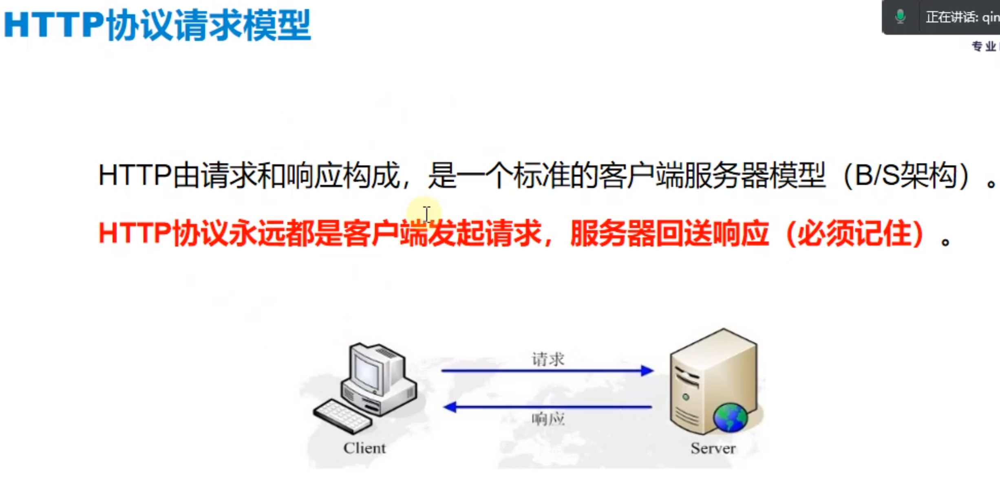

# 一、接口和协议的概念

## 1.什么是接口？

## 2.协议的概念

------

# 二、常见的网络协议

## 1. TCP/ IP 四层协议模型

## 2.常见应用层协议

## 3. HTTP协议

- ### HTTP协议之URL组成

  

- ###  DNS : Domain Name Server, 域名服务器

- ### 可以通过在cmd界面ping 一个网址来查看其真正的ip地址

  

## 4. HTTP 协议请求模型

- ### BS架构: 又叫浏览器/服务器模型，严格意义上来说，B并不仅仅是浏览器(Browser), 凡是能够发送HTTP请求的对象或者工具都可以叫客户端.

## 5. HTTP请求过程(工作过程)

## 6. HTTP协议的特性

### a. 无连接性

### b.无状态性

## 7. HTTP 协议的请求类型

- ###  GET 和 POST的区别

  

------

# 三、HTTP抓包操作

## 1. Chrome抓包操作

- ### 范例

  

  

## 2. Fiddler抓包操作(PC端抓包、移动端抓包)

### a. Fiddler抓包概念模型

### b. Fiddler抓包设置

- ### 手机端设置步骤范例

  

------

# 四、  HTTP请求组成部分

## 1. URL地址

## 2. 请求参数

## 3.请求头

## 4.请求体(仅限POST请求)

------

# 五、HTTP响应部分

## 1.响应状态码

- ### 响应状态码举例

  

## 2.响应内容

------

# 六、接口测试的概念

## 1.什么是接口测试?

## 2.接口测试的优势

## 3.借口设计文档

- ### 接口设计文档举例

  

## 4.接口测试用例设计

### a. 接口测试用例设计点

### b.接口测试要点总结

### c.接口测试用例范例

